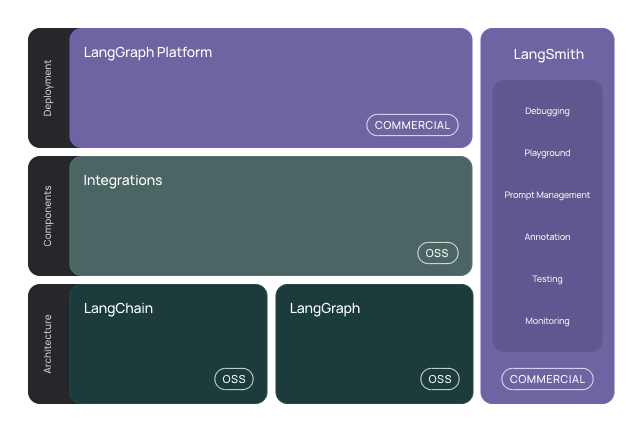

# 🦜🔗 Awesome LangGraph Ecosystem  

> A comprehensive curated list of awesome projects, resources, tools, and packages for building AI applications with the [LangChain Ecosystem](https://github.com/langchain-ai). 

**Discover the complete LangGraph universe** - from foundational frameworks and production platforms to cutting-edge community innovations. Whether you're building your first AI agent or scaling to enterprise deployments, this collection provides everything you need to navigate the rapidly evolving world of LangChain development.

## 📋 Table of Contents

### 🏗️ Core Frameworks & Platforms
- [**LangChain (OSS)**](#langchain-oss) - Foundational framework for LLM applications
- [**LangGraph (OSS)**](#langgraph-oss) - Agent orchestration and multi-agent systems  
- [**LangSmith (Platform)**](#langsmith-platform) - Observability, evaluation, and prompt engineering
- [**LangGraph Platform**](#langgraph-platform) - Production deployment and management

### 🔗 Integrations & Extensions
- [**LangChain Integrations & Partners**](#langchain-integrations--partners) - Third-party providers and tools

### 🏢 Official Projects
- [**Official LangChain Projects**](#official-langchain-projects) - Production-ready components and applications
  - [Specialized Agent Libraries](#specialized-agent-libraries)
  - [Applications](#applications) 
  - [Development Tools](#development-tools)

### 🌟 Community Projects 
- [**🧬 Biology Medicine and Bioinformatics**](#-biology-medicine-and-bioinformatics) 
- [**📂 Browser Automation**](#-browser-automation) 
- [**📊 Business Intelligence**](#-business-intelligence) 
- [**🖥️ Chat Interfaces & GUIs**](#️-chat-interfaces--guis) 
- [**☁️ Cloud Platforms**](#️-cloud-platforms) 
- [**🤖 Coding Agents**](#-coding-agents) 
- [**💬 Communication**](#-communication) 
- [**📊 Data Platforms**](#-data-platforms) 
- [**🧮 Data Science**](#-data-science) 
- [**🛠️ Developer Tools**](#️-developer-tools) 
- [**💰 Finance & Fintech**](#-finance--fintech) 
- [**🎯 Marketing**](#-marketing) 
- [**🔗 Model Context Protocol (MCP)**](#-model-context-protocol-mcp) 
- [**🎥 Multimedia Processing**](#-multimedia-processing) 
- [**📚 RAG & Document Processing**](#-rag--document-processing) 
- [**🔬 Research Agents**](#-research-agents) 
- [**🔎 Search & Data Extraction**](#-search--data-extraction) 
- [**🌐 Social Media**](#-social-media) 
- [**🌍 Sustainability**](#-sustainability) 
- [**📋 Templates**](#-templates) 
- [**🎤 Voice Interfaces**](#-voice-interfaces) 
- [**🏢 Workplace & Productivity**](#-workplace--productivity)
- [**🛠️ Other Tools and Integrations**](#️-other-tools-and-integrations)  

---

## What is the LangChain Ecosystem?

The **LangChain Ecosystem** is a comprehensive suite of frameworks and platforms for building, deploying, and managing LLM-powered applications. While **LangGraph** can be used standalone, it integrates seamlessly with any LangChain product, giving developers a full suite of tools for building agents.

  
  
Source: <a href="https://python.langchain.com/docs/introduction/">LangChain Documentation</a>

### Ecosystem Components:

**LangGraph (OSS)** - The core framework for building stateful, multi-agent systems with complex workflows, collaboration, and memory management.

**LangSmith (Platform)** - Helpful for agent evaluations and observability. Debug poor-performing LLM app runs, evaluate agent trajectories, gain visibility in production, and improve performance over time.

**LangGraph Platform** - Deploy and scale agents effortlessly with a purpose-built deployment platform for long running, stateful workflows. Discover, reuse, configure, and share agents across teams — and iterate quickly with visual prototyping in LangGraph Studio.

**LangChain (OSS)** - Provides integrations and composable components to streamline LLM application development. Contains agent abstractions built on top of LangGraph.

> [!TIP]
> **LangChain v1.0** introduces a major architectural shift where **all LangChain agents are now built on top of LangGraph**. This provides better control, state management, and debugging capabilities for agent workflows. The v1.0 documentation reflects this new LangGraph-first approach to agent development.

━━━━━━━━━━━━━━━━━━━━━━━━━━━━━━━━━━━━━━━━━━━━━━━━━━━━━━━━━━━━━━━━━━━━━━━━━━━━━━━━━━━━━━━━━━━━━━━━━━━

## 🦜 LangChain (OSS)

 

**LangChain** is the foundational framework for building applications with Large Language Models (LLMs). It provides standardized interfaces, reusable components, and extensive integrations that enable developers to create sophisticated AI applications through composable building blocks.

<strong>Core Components and Usage</strong>

**Essential building blocks and advanced capabilities for LangChain applications** - from fundamental components to sophisticated AI features.

### Core Components
*Essential building blocks for LangChain applications*

| Component | Description |
|-----------|-------------|
| **🤖 [Agents](https://docs.langchain.com/oss/python/langchain/agents)** | Decision-making systems that use LLMs to determine which actions to take |
| **🧠 [Models](https://docs.langchain.com/oss/python/langchain/models)** | Unified interfaces for LLMs and embedding models across providers |
| **💬 [Messages](https://docs.langchain.com/oss/python/langchain/messages)** | Structured communication format between components |
| **🛠️ [Tools](https://docs.langchain.com/oss/python/langchain/tools)** | External function calls and integrations for agents |
| **🧭 [Short-term Memory](https://docs.langchain.com/oss/python/langchain/short-term-memory)** | Working memory for maintaining conversation context |
| **⚡ [Streaming](https://docs.langchain.com/oss/python/langchain/streaming)** | Real-time response processing for partial results |

### Advanced Usage
*Advanced capabilities and techniques for sophisticated AI applications*

| Feature | Description |
|---------|-------------|
| **🧠 [Long-term Memory](https://docs.langchain.com/oss/python/langchain/long-term-memory)** | Persistent memory that survives across sessions |
| **🎯 [Context Engineering](https://docs.langchain.com/oss/python/langchain/context-engineering)** | Techniques for optimizing prompts and context management |
| **📋 [Structured Output](https://docs.langchain.com/oss/python/langchain/structured-output)** | Generate responses in specific formats and schemas |
| **🔗 [Model Context Protocol (MCP)](https://docs.langchain.com/oss/python/langchain/mcp)** | Standardized tool integration and context sharing |
| **👥 Human-in-the-Loop** | Interactive agent workflows with human oversight (*Coming Soon*) |
| **🤝 [Multi-agent](https://docs.langchain.com/oss/python/langchain/multi-agent)** | Coordinated systems with multiple AI agents |
| **🔍 [Retrieval](https://docs.langchain.com/oss/python/langchain/retrieval)** | Advanced document retrieval and RAG patterns |
| **⚙️ [Runtime](https://docs.langchain.com/oss/python/langchain/runtime)** | Production deployment and runtime management |
| **🔧 [Middleware](https://docs.langchain.com/oss/python/langchain/middleware)** | Custom processing layers and request/response modification |

  ✧ ✧ ✧ ✧ ✧ ✧ ✧ ✧ ✧ ✧ ✧ ✧ ✧ ✧ ✧ ✧ ✧ ✧ ✧ ✧ ✧ ✧ ✧ ✧ ✧ ✧ ✧

<strong>LangChain Libraries</strong>

| Package | Python | TypeScript | Description |
|---------|--------|------------|-------------|
| **LangChain** | [`langchain`](https://github.com/langchain-ai/langchain/tree/master/libs/langchain) | [`langchain`](https://github.com/langchain-ai/langchainjs/tree/main/langchain) | Main framework with chains, agents, retrieval methods, and cognitive architecture |
| **LangChain Core** | [`langchain-core`](https://github.com/langchain-ai/langchain/tree/master/libs/core) | [`@langchain/core`](https://github.com/langchain-ai/langchainjs/tree/main/libs/langchain-core) | Base abstractions and runtime for the entire ecosystem |
| **Community** | [`langchain-community`](https://github.com/langchain-ai/langchain/tree/master/libs/community) | [`@langchain/community`](https://github.com/langchain-ai/langchainjs/tree/main/libs/langchain-community) | Third-party integrations and community contributions |
| **MCP Adapters** | [`langchain-mcp-adapters`](https://github.com/langchain-ai/langchain-mcp-adapters) | - | Make Anthropic MCP tools compatible with agents |
| **Text Splitters** | [`langchain-text-splitters`](https://github.com/langchain-ai/langchain/tree/master/libs/text-splitters) | [`@langchain/textsplitters`](https://github.com/langchain-ai/langchainjs/tree/main/libs/langchain-textsplitters) | Document processing and text splitting utilities |
| **Experimental** | [`langchain-experimental`](https://github.com/langchain-ai/langchain/tree/master/libs/experimental) | [`@langchain/experimental`](https://github.com/langchain-ai/langchainjs/tree/main/libs/langchain-experimental) | Beta features and experimental components |
| **CLI Tools** | [`langchain-cli`](https://github.com/langchain-ai/langchain/tree/master/libs/cli) | - | Command line interface for project management |
| **Legacy** | [`langchain-legacy`](https://github.com/langchain-ai/langchain/tree/master/libs/legacy) | - | Legacy components from pre-v1.0 (Python only) |

  ♦ ♦ ♦ ♦ ♦ ♦ ♦ ♦ ♦ ♦ ♦ ♦ ♦ ♦ ♦ ♦ ♦ ♦ ♦ ♦ ♦ ♦ ♦ ♦ ♦ ♦ ♦

<strong>LangChain Documentation</strong>

Access the official LangChain documentation across different versions and languages:

| Version | Python | JavaScript | Status |
|---------|--------|------------|--------|
| **v1.0 Alpha** | [Alpha Docs](https://docs.langchain.com/oss/python/langchain/overview) | [Alpha Docs](https://docs.langchain.com/oss/javascript/langchain/) | 🚧 Alpha |
| **v0.3** | [Stable Docs](https://python.langchain.com/docs/introduction/) | [Stable Docs](https://js.langchain.com/docs/introduction/) | ✅ Stable |

━━━━━━━━━━━━━━━━━━━━━━━━━━━━━━━━━━━━━━━━━━━━━━━━━━━━━━━━━━━━━━━━━━━━━━━━━━━━━━━━━━━━━━━━━━━━━━━━━━━

## 🕸️ LangGraph (OSS)

 

**LangGraph** is an open-source framework for building **AI agents and multi-agent systems** as graphs, and is a core part of the **LangChain Ecosystem**. It focuses on **agent orchestration**, enabling sophisticated AI applications that can maintain state, coordinate multiple agents, and handle complex reasoning processes through graph-based workflows.

<strong>Core Capabilities</strong>

| Capability | Description | Key Features |
|------------|-------------|--------------|
| **💾 Persistence** | State persistence across executions and failures | Checkpointing, state recovery, session continuity |
| **🔄 Durable Execution** | Build agents that persist through failures and run for extended periods | Automatic resume, failure recovery, long-running workflows |
| **⚡ Streaming** | Real-time execution with partial results and live updates | Token streaming, progress tracking, responsive UX |
| **👥 Human-in-the-Loop** | Seamless human oversight and intervention capabilities | Approval workflows, manual interventions, state inspection |
| **⏰ Time Travel** | Navigate through agent execution history and states | State debugging, execution replay, historical analysis |
| **🧠 Add and Manage Memory** | Comprehensive memory management for stateful agents | Short-term working memory, long-term persistence, memory optimization |
| **📊 Subgraphs** | Nested graph structures for complex workflow composition | Modular workflows, reusable components, hierarchical execution |

---

<strong>LangGraph Libraries and SDKs</strong>

| Package | Python | TypeScript | Description |
|---------|--------|------------|-------------|
| **LangGraph** | [`langgraph`](https://github.com/langchain-ai/langgraph) | [`@langchain/langgraph`](https://github.com/langchain-ai/langgraphjs) | Core graph-based agent orchestration framework |
| **LangGraph CLI** | [`langgraph-cli`](https://github.com/langchain-ai/langgraph/tree/main/libs/cli) | [`@langchain/langgraph-cli`](https://github.com/langchain-ai/langgraphjs/tree/main/libs/langgraph-cli) | Command line interface for LangGraph development and deployment |
| **LangGraph SDK** | [Python SDK](https://docs.langchain.com/langgraph-platform/sdk) | [JavaScript SDK](https://docs.langchain.com/langgraph-platform/sdk) | Official SDKs for interacting with **LangGraph Platform(Server)** and deployed applications |

  ◆ ◆ ◆ ◆ ◆ ◆ ◆ ◆ ◆ ◆ ◆ ◆ ◆ ◆ ◆ ◆ ◆ ◆ ◆ ◆ ◆ ◆ ◆ ◆ ◆ ◆ ◆

<strong>LangGraph Starter Templates</strong>

Get started quickly with LangGraph using the CLI command `langgraph new` to choose from pre-built templates:

| Template | Description | Python | TypeScript |
|----------|-------------|--------|------------|
| **New Project** | Basic chatbot with memory | [new-langgraph-project](https://github.com/langchain-ai/new-langgraph-project) | [new-langgraphjs-project](https://github.com/langchain-ai/new-langgraphjs-project) |
| **ReAct Agent** | Tool-using agent framework | [react-agent](https://github.com/langchain-ai/react-agent) | [react-agent-js](https://github.com/langchain-ai/react-agent-js) |
| **Memory Agent** | Cross-thread memory persistence | [memory-agent](https://github.com/langchain-ai/memory-agent) | [memory-agent-js](https://github.com/langchain-ai/memory-agent-js) |
| **Retrieval Agent** | Knowledge-based QA system | [retrieval-agent-template](https://github.com/langchain-ai/retrieval-agent-template) | [retrieval-agent-template-js](https://github.com/langchain-ai/retrieval-agent-template-js) |
| **Data Enrichment** | Web search & data organization | [data-enrichment](https://github.com/langchain-ai/data-enrichment) | [data-enrichment-js](https://github.com/langchain-ai/data-enrichment-js) |

  ▫ ▫ ▫ ▫ ▫ ▫ ▫ ▫ ▫ ▫ ▫ ▫ ▫ ▫ ▫ ▫ ▫ ▫ ▫ ▫ ▫ ▫ ▫ ▫ ▫ ▫ ▫

<strong>LangGraph Libraries and SDKs</strong>

Access the official LangGraph documentation across different languages:

| Language | Framework | Documentation |
|----------|-----------|---------------|
| **Python** | LangGraph | [Python Docs](https://docs.langchain.com/langgraph/overview) |
| **JavaScript** | LangGraph.js | [JavaScript Docs](https://docs.langchain.com/langgraphjs/overview) |

━━━━━━━━━━━━━━━━━━━━━━━━━━━━━━━━━━━━━━━━━━━━━━━━━━━━━━━━━━━━━━━━━━━━━━━━━━━━━━━━━━━━━━━━━━━━━━━━━━━

## 🛠️ LangSmith (Platform)

**LangSmith** is a platform for building production-grade LLM applications with comprehensive observability, evaluation, and prompt engineering capabilities. It's framework agnostic and works with or without LangChain's open source frameworks.

> [!TIP]
> **Get started with LangSmith for free!** Sign up at [langchain.com/langsmith](https://www.langchain.com/langsmith) and follow the [quickstart guide](https://docs.langchain.com/langsmith/observability-quickstart) to add tracing and monitoring to your LLM applications in minutes.

---

<strong>Core Features</strong>

| Feature | Description | Key Capabilities |
|---------|-------------|-----------------|
| **📊 Tracing** | Gain visibility into each step your application takes | Debug faster, understand application flow, execution monitoring |
| **📈 Evaluation** | Measure quality of applications over time | Automated testing, quality measurement, performance tracking |
| **✏️ Prompt Testing** | Iterate on prompts with version control | Prompt optimization, collaboration, automatic versioning |
| **🏢 Workspace Management** | Team collaboration and project organization | Admin settings, team collaboration, project configuration |

  ● ● ● ● ● ● ● ● ● ● ● ● ● ● ● ● ● ● ● ● ● ● ● ● ● ● ●

<strong>LangSmith SDK</strong>

| Package | Python | TypeScript | Description |
|---------|--------|------------|-------------|
| **LangSmith Client SDK** | [`langsmith`](https://github.com/langchain-ai/langsmith-sdk) | [`langsmith`](https://github.com/langchain-ai/langsmith-sdk) | Official SDK for LangSmith platform integration |

  ★ ★ ★ ★ ★ ★ ★ ★ ★ ★ ★ ★ ★ ★ ★ ★ ★ ★ ★ ★ ★ ★ ★ ★ ★ ★ ★

<strong>LangSmith Documentation</strong>

Access the official LangSmith platform documentation:

| Platform | Documentation |
|----------|---------------|
| **LangSmith** | [Platform Docs](https://docs.langchain.com/langsmith/home) |

---

## LangChain Integrations & Partners

**Third-party integrations and provider packages** that extend LangChain's capabilities across the AI ecosystem. These integration packages provide standardized interfaces to work with popular AI services, databases, and tools.

> [!TIP]
> **Easy Installation:** Install any provider with `pip install langchain-{provider}` for Python or `npm install @langchain/{provider}` for JavaScript.

<strong>Chat Models</strong>

**Language models that use message sequences as input/output for conversational AI.** Support tool calling, structured output, streaming, and multimodal inputs for building sophisticated chat applications.

- **Python**: [Browse providers](https://docs.langchain.com/oss/python/integrations/chat)
- **JavaScript**: [Browse providers](https://docs.langchain.com/oss/javascript/integrations/chat)

  ▲ ▲ ▲ ▲ ▲ ▲ ▲ ▲ ▲ ▲ ▲ ▲ ▲ ▲ ▲ ▲ ▲ ▲ ▲ ▲ ▲ ▲ ▲ ▲ ▲ ▲ ▲

<strong>Embedding Models</strong>

**Transform raw text into fixed-length vectors that capture semantic meaning.** Enable machines to compare and search text based on meaning rather than exact words. Essential for RAG applications and semantic search.

- **Python**: [Browse providers](https://docs.langchain.com/oss/python/integrations/text_embedding)
- **JavaScript**: [Browse providers](https://docs.langchain.com/oss/javascript/integrations/text_embedding)

  ◯ ◯ ◯ ◯ ◯ ◯ ◯ ◯ ◯ ◯ ◯ ◯ ◯ ◯ ◯ ◯ ◯ ◯ ◯ ◯ ◯ ◯ ◯ ◯ ◯ ◯ ◯

<strong>Vector Stores</strong>

**Databases optimized for storing and querying high-dimensional vectors using similarity metrics.** Used with embedding models to enable semantic search, document retrieval, and knowledge base applications.

- **Python**: [Browse providers](https://docs.langchain.com/oss/python/integrations/vectorstores)
- **JavaScript**: [Browse providers](https://docs.langchain.com/oss/javascript/integrations/vectorstores)

<strong>Document Loaders</strong>

**Integrations for ingesting data from hundreds of sources.** Including PDFs, websites, databases, APIs, and cloud services. Transform diverse data formats into LangChain Document objects for processing.

- **Python**: [Browse providers](https://docs.langchain.com/oss/python/integrations/document_loaders)
- **JavaScript**: [Browse providers](https://docs.langchain.com/oss/javascript/integrations/document_loaders)

<strong>Tools & Toolkits</strong>

**Enable agents to interact with external systems.** Define input schemas for tool calling and executing actions. Support web search, database queries, file operations, and API integrations.

- **Python**: [Browse providers](https://docs.langchain.com/oss/python/integrations/tools)
- **JavaScript**: [Browse providers](https://docs.langchain.com/oss/javascript/integrations/tools)

<strong>Retrievers</strong>

**Advanced retrieval strategies that combine dense and sparse search methods.** Enable sophisticated document retrieval patterns including hybrid search, reranking, and context-aware retrieval for RAG applications.

- **Python**: [Browse providers](https://docs.langchain.com/oss/python/integrations/retrievers)
- **JavaScript**: [Browse providers](https://docs.langchain.com/oss/javascript/integrations/retrievers)

<strong>Text Splitters</strong>

**Break large documents into smaller, manageable chunks.** Maintain semantic coherence while fitting within model context windows. Essential for RAG pipelines and document processing workflows.

- **Python**: [Browse providers](https://docs.langchain.com/oss/python/integrations/text_splitters)
- **JavaScript**: [Browse providers](https://docs.langchain.com/oss/javascript/integrations/text_splitters)

<strong>Key-Value Stores</strong>

**Simple storage interfaces for caching and state management.** Support caching embeddings, storing application state, and managing key-value data with various backends including Redis, file systems, and in-memory storage.

- **Python**: [Browse providers](https://docs.langchain.com/oss/python/integrations/stores)
- **JavaScript**: [Browse providers](https://docs.langchain.com/oss/javascript/integrations/stores)

━━━━━━━━━━━━━━━━━━━━━━━━━━━━━━━━━━━━━━━━━━━━━━━━━━━━━━━━━━━━━━━━━━━━━━━━━━━━━━━━━━━━━━━━━━━━━━━━━━━

## 🚀 LangGraph Platform

**LangGraph Platform** is a comprehensive solution for deploying and managing agentic applications at scale. It provides production-ready infrastructure, developer tools, and management capabilities for LangGraph applications.

<strong>LangGraph Server</strong>

**API platform for creating and managing agent-based applications.** Built on the concept of assistants (agents configured for specific tasks) with built-in persistence and task queue for production deployments.

**Key Features:**
- Agent management (assistants, threads, runs)
- Built-in persistence with PostgreSQL
- Task queue with Redis
- Background processing and real-time interactions
- Cron jobs and webhooks support
- Enterprise deployment options (Cloud, Hybrid, Self-hosted)

**Documentation:** [LangGraph Server](https://docs.langchain.com/langgraph-platform/langgraph-server)

  ◈ ◈ ◈ ◈ ◈ ◈ ◈ ◈ ◈ ◈ ◈ ◈ ◈ ◈ ◈ ◈ ◈ ◈ ◈ ◈ ◈ ◈ ◈ ◈ ◈ ◈ ◈

<strong>LangGraph CLI</strong>

**Multi-platform command-line tool for building and running LangGraph API servers locally.** Includes all API endpoints and services required for agent development and deployment.

**Key Commands:**
- `langgraph build` - Build Docker images for deployment
- `langgraph dev` - Start lightweight development server
- `langgraph up` - Start local Docker container instance
- `langgraph dockerfile` - Generate custom Dockerfiles

**Documentation:** [LangGraph CLI](https://docs.langchain.com/langgraph-platform/langgraph-cli)

<strong>LangGraph Studio</strong>

**Specialized agent IDE for visualization, interaction, and debugging of agentic systems.** Connects to LangGraph Server and integrates with LangSmith for comprehensive development experience.

**Key Features:**
- Graph architecture visualization
- Interactive agent testing and debugging
- Assistant and thread management
- Prompt iteration and experimentation
- Time travel debugging and state inspection
- LangSmith integration for tracing and evaluation

**Documentation:** [LangGraph Studio](https://docs.langchain.com/langgraph-platform/langgraph-studio)

<strong>Python/JS SDK</strong>

**Programmatic interfaces for interacting with deployed LangGraph applications.** Provides both synchronous and asynchronous clients for comprehensive API access.

**Key Features:**
- Full API access to LangGraph Server
- Synchronous and asynchronous client support
- TypeScript support with type safety
- React hooks for frontend integration
- State management and streaming support

**Documentation:** [Python SDK](https://docs.langchain.com/langgraph-platform/sdk) | [JavaScript SDK](https://docs.langchain.com/langgraph-platform/reference-overview)

<strong>Remote Graph</strong>

**Interface for interacting with deployed LangGraph applications as if they were running locally.** Seamlessly bridge local development with production deployments.

**Key Features:**
- Local-like interaction with remote deployments
- Compatible with existing LangGraph APIs
- Assistant and graph ID support
- Transparent remote execution
- Development workflow integration

**Documentation:** [Remote Graph](https://docs.langchain.com/langgraph-platform/use-remote-graph)

<strong>Control Plane</strong>

**Management interface for creating and updating LangGraph Server deployments.** Provides UI and APIs for deployment configuration and administration.

**Key Features:**
- Deployment creation and management
- Configuration and environment settings
- Database provisioning (automatic PostgreSQL setup)
- Team collaboration and access control
- API orchestration for CI/CD workflows

**Documentation:** [Control Plane](https://docs.langchain.com/langgraph-platform/control-plane)

<strong>Data Plane</strong>

**Runtime infrastructure encompassing LangGraph Servers and supporting components.** Includes all infrastructure required for production agent deployments.

**Key Infrastructure:**
- LangGraph Server instances
- PostgreSQL databases for persistence
- Redis for task queue management
- Secrets store and autoscalers
- Listener applications for Control Plane updates

**Documentation:** [Data Plane](https://docs.langchain.com/langgraph-platform/data-plane)

---

## Official LangChain Projects

**Production-ready components and applications built and maintained by the LangChain team.** These projects provide tested solutions, reference implementations, and specialized tools to accelerate your AI application development.

---

### Specialized Agent Libraries

**Pre-built agent packages** for specific use cases and interaction patterns:

| Agent Library | Purpose | Key Features | Python | TypeScript |
|---------------|---------|--------------|--------|------------|
| **Computer Use Agent** | Automate computer interactions and GUI tasks | Screen interaction, click/type automation, visual reasoning | [`langgraph-cua-py`](https://github.com/langchain-ai/langgraph-cua-py) | [`langgraph-cua`](https://github.com/langchain-ai/langgraphjs/tree/main/libs/langgraph-cua) |
| **Swarm Agent** | Coordinate multiple specialized agents | Dynamic task distribution, collective intelligence | [`langgraph-swarm-py`](https://github.com/langchain-ai/langgraph-swarm-py) | [`langgraph-swarm`](https://github.com/langchain-ai/langgraphjs/tree/main/libs/langgraph-swarm) |
| **Supervisor** | Hierarchical multi-agent coordination | Agent delegation, task planning, workflow management | [`langgraph-supervisor-py`](https://github.com/langchain-ai/langgraph-supervisor-py) | [`langgraph-supervisor`](https://github.com/langchain-ai/langgraphjs/tree/main/libs/langgraph-supervisor) |
| **MCP Adapters** | Integrate Anthropic MCP tools with agents | Tool compatibility, protocol bridging | [`langchain-mcp-adapters`](https://github.com/langchain-ai/langchain-mcp-adapters) | -- |
| **LangMem** | Build agents with persistent learning capabilities | Memory management, experience replay, adaptation | [`langmem`](https://github.com/langchain-ai/langmem) | -- |
| **CodeAct** | Advanced code generation and execution | Function calling, code analysis, debugging | [`langgraph-codeact`](https://github.com/langchain-ai/langgraph-codeact) | -- |
| **Reflection** | Self-improving agents with review capabilities | Self-critique, iterative improvement, quality control | [`langgraph-reflection`](https://github.com/langchain-ai/langgraph-reflection) | -- |
| **BigTool** | Handle large-scale tool ecosystems | Tool management, selection optimization | [`langgraph-bigtool`](https://github.com/langchain-ai/langgraph-bigtool) | -- |
| **Deep Agents** | Build agents capable of complex, long-term planning and execution | Planning tools, sub-agents, file system access, detailed prompts | [`deepagents`](https://github.com/langchain-ai/deepagents) | -- |

---

### Applications

**Complete application examples** showcasing different patterns and use cases:

| Application | Description |
|-------------|-------------|
| [**Open Agent Platform**](https://github.com/langchain-ai/open-agent-platform) | No-code platform for building customizable agents with MCP tools integration, LangConnect RAG support, and multi-agent supervision capabilities. Features a modern web interface and pre-built agent templates. |
| [**LangConnect**](https://github.com/langchain-ai/langconnect) | Managed RAG service with FastAPI and PostgreSQL/pgvector integration, featuring document collection management, semantic search, and Docker deployment support. |
| [**ChatLangChain**](https://github.com/langchain-ai/chat-langchain) | Documentation assistant powered by RAG-based semantic search with intelligent query analysis. Features automated content indexing, duplicate prevention, GenUI, and sophisticated document tracking system. |
| [**OpenGPTs**](https://github.com/langchain-ai/opengpts) | Open-source GPT alternative supporting 60+ LLM providers and tools. Implements three cognitive architectures (Assistant, RAG, Chatbot) with PostgreSQL backend and flexible deployment options. |
| [**Executive AI Assistant**](https://github.com/langchain-ai/executive-ai-assistant) | Smart email management system with calendar integration. Provides intelligent triage, automated response drafting, and meeting coordination through Gmail API with customizable workflows. |
| [**Agent Inbox**](https://github.com/langchain-ai/agent-inbox) | Centralized interface for AI agent interactions featuring real-time communication, interrupt handling, and configurable response systems for both local and cloud deployments. |
| [**Python Fullstack**](https://github.com/langchain-ai/langgraph-fullstack-python) | All-in-one chatbot template combining React-style agents with modern UI. Built with FastHTML components and Claude 3, featuring single-deployment architecture and extensible tools. |
| [**LangGraph UI Examples**](https://github.com/langchain-ai/langgraphjs-gen-ui-examples) | Showcase of generative UI agents including stockbroker, trip planner, and email tools. Demonstrates human-in-the-loop workflows with customizable components and tool integrations. |
| [**LangChain Next.js**](https://github.com/langchain-ai/langchain-nextjs-template) | Next.js starter template showcasing LangChain.js modules. Includes streaming chat, structured output, multi-step agents, and RAG implementations with Vercel AI SDK integration. |
| [**Custom Auth**](https://github.com/langchain-ai/custom-auth) | Supabase-powered authentication template for LangGraph deployments. Implements OAuth2 with Google, user management, and secure chatbot access with conversation thread isolation. |
| [**Gen UI Computer Use**](https://github.com/bracesproul/gen-ui-computer-use) | A Generative UI web app for interacting with Computer Use Agents (CUA) via the `@langchain/langgraph-cua` prebuilt package. Features a modern interface for computer automation and task management. |
| [**Multi-Modal Researcher**](https://github.com/langchain-ai/multi-modal-researcher) | Research and podcast generation workflow using LangGraph with Gemini 2.5 model family. Features video understanding, Google search integration, and multi-speaker text-to-speech for creating comprehensive research reports and audio podcasts. |
| [**Deep Agents UI**](https://github.com/langchain-ai/deep-agents-ui) | Next.js interface for Deep Agents with streaming support and LangGraph Platform integration. Generic AI agents capable of handling tasks of varying complexity with customizable UI components. |

---

### Development Tools

**Development tools** for building, visualizing, and deploying LangGraph applications:

| Tool | Purpose | Capabilities |
|------|---------|-------------|
| [**LangGraph Builder**](https://github.com/langchain-ai/langgraph-builder) | Visual Development | Drag-and-drop graph design, code generation for Python/TypeScript |
| [**LangGraph Generator**](https://github.com/langchain-ai/langgraph-gen-py) | Code Generation | YAML-to-code conversion, project scaffolding, boilerplate automation |

---

# Community Projects Categorization Proposal

Based on the reference categories provided and analysis of the existing 87 community projects, here's a proposed categorization structure organized alphabetically:

## 🧬 Biology Medicine and Bioinformatics
*Healthcare, medical diagnosis, genomic research, and scientific research agents*

| Project | Description | GitHub Stars |
|---------|-------------|--------------|
| [souvikmajumder26/Multi-Agent-Medical-Assistant](https://github.com/souvikmajumder26/Multi-Agent-Medical-Assistant) | AI-powered multi-agent system for medical diagnosis, research, and patient interaction, featuring LLMs, RAG, and human-in-the-loop validation |  |
| [ArcInstitute/SRAgent](https://github.com/ArcInstitute/SRAgent) | Multi-agent framework for automating genomic research and RNA sequencing workflows from scientific databases |  |

## 📂 Browser Automation  
*Agents for web automation, browser control, and web task automation*

| Project | Description | GitHub Stars |
|---------|-------------|--------------|
| [Clevrr-AI/Clevrr-Computer](https://github.com/Clevrr-AI/Clevrr-Computer) | Automation agent for basic computer tasks with a focus on safety and accuracy |  |
| [hrithikkoduri/WebRover](https://github.com/hrithikkoduri/WebRover) | Autonomous AI agent for automating web tasks and research |  |
| [esinecan/agentic-ai-browser](https://github.com/esinecan/agentic-ai-browser) | AI-driven web automation agent emphasizing intelligent design over brute force, featuring behavioral caching, DOM-based task fidelity, success pattern recording, and single-agent architecture for efficient browser automation |  |
| [browser-use/browser-use](https://github.com/browser-use/browser-use) | Library for AI agents to interact with websites and automate web tasks |  |
| [ScrapeGraphAI/scrapecraft](https://github.com/ScrapeGraphAI/scrapecraft) | AI-powered web scraping editor with visual workflow builder using LangGraph and ScrapeGraphAI. Features natural language scraping pipeline creation, multi-URL bulk scraping, and real-time WebSocket streaming with Docker deployment |  |

## 📊 Business Intelligence
*Business analysis, market research, and strategic intelligence tools*

| Project | Description | GitHub Stars |
|---------|-------------|--------------|
| [oba2311/analyst_agent](https://github.com/oba2311/analyst_agent) | AI-powered marketing analysis system built with LangChain, featuring market trend forecasting, sentiment analysis, campaign evaluation, and automated report generation with strategic recommendations |  |

## 🖥️ Chat Interfaces & GUIs
*Frontend applications, chat interfaces, and graphical user interfaces for AI agents*

| Project | Description | GitHub Stars |
|---------|-------------|--------------|
| [GaiZhenbiao/ChuanhuChatGPT](https://github.com/GaiZhenbiao/ChuanhuChatGPT) | Comprehensive GUI for ChatGPT API and multiple LLMs with agent support, file-based QA, web search integration, and GPT fine-tuning capabilities. Features auto-naming conversations, knowledge base functionality, and beautiful UI with PWA support |  |

## ☁️ Cloud Platforms
*Cloud infrastructure management, deployment automation, and cloud resource management*

| Project | Description | GitHub Stars |
|---------|-------------|--------------|
| [eosho/ARMA](https://github.com/eosho/ARMA) | Azure Resource Management Assistant built with LangGraph and LangChain, featuring multi-agent architecture for Azure resource provisioning, ARM template validation, and comprehensive resource management with Streamlit UI |  |

## 🤖 Coding Agents
*AI agents specifically designed for software development, code generation, and programming assistance*

| Project | Description | GitHub Stars |
|---------|-------------|--------------|
| [KodyKendall/LlamaBot](https://github.com/KodyKendall/LlamaBot) | Web development coding agent that helps create HTML/CSS/JavaScript projects, featuring game creation, portfolio websites, and business landing pages with LangGraph orchestration |  |
| [AbhinavTheDev/coding-agent](https://github.com/AbhinavTheDev/coding-agent) | Development tool that uses LangGraph agents to aid coding workflow with natural language |  |
| [langtalks/swe-agent](https://github.com/langtalks/swe-agent) | AI-powered software engineering multi-agent system featuring researcher and developer agents that automate code implementation through intelligent planning, execution, and atomic task breakdown with LangGraph workflows |  |

## 💬 Communication
*Messaging platforms, social media agents, and communication tools*

| Project | Description | GitHub Stars |
|---------|-------------|--------------|
| [kargarisaac/telegram_link_summarizer_agent](https://github.com/kargarisaac/telegram_link_summarizer_agent) | Agentic Telegram bot that summarizes links (articles, papers, tweets, LinkedIn posts, PDFs) shared in a channel using LangGraph orchestration, BAML integration, and multi-tool content extraction |  |
| [lgesuellip/langgraph-whatsapp-agent](https://github.com/lgesuellip/langgraph-whatsapp-agent) | Template for building scalable WhatsApp AI agents with LangGraph, supporting multi-agent systems, image processing, and MCP integration |  |
| [benjichat/voice_agent_base](https://github.com/benjichat/voice_agent_base) | Voice-enabled AI agent application with React interface, featuring speech-to-text via OpenAI Whisper, text-to-speech via ElevenLabs, and web search capabilities through Tavily integration |  |

## 👤 Customer Data Platforms
*Customer support, CRM systems, and customer interaction management*

## 📊 Data Platforms  
*Data analysis, visualization, business intelligence, and data processing agents*

| Project | Description | GitHub Stars |
|---------|-------------|--------------|
| [starpig1129/AI-Data-Analysis-MultiAgent](https://github.com/starpig1129/AI-Data-Analysis-MultiAgent) | Multi-agent system for data analysis, visualization, and report generation |  |
| [raj-maharajwala/AI_Agent_Chatbot_Synapse](https://github.com/raj-maharajwala/AI_Agent_Chatbot_Synapse) | Multi-agent platform with three specialized AI agents: Smart Search Agent for real-time web search, Productivity Assistant for task automation, and Data Analysis Agent for dataset insights and visualization |  |

## 🧮 Data Science 
*Machine learning, statistical analysis, and data science workflow automation*

| Project | Description | GitHub Stars |
|---------|-------------|--------------|
| [business-science/ai-data-science-team](https://github.com/business-science/ai-data-science-team) | AI-powered data science team for common tasks |  |
| [RichardKaranuMbuti/ScienceBridge](https://github.com/RichardKaranuMbuti/ScienceBridge) | AI-powered scientific research accelerator that autonomously analyzes datasets, generates hypotheses, and validates them through code, featuring ML model integration and automated visualization |  |
| [project-ryoma/ryoma](https://github.com/project-ryoma/ryoma) | AI-powered data agent framework for data analysis, engineering, and visualization, combining LangChain, Reflex, Apache Arrow, and more |  |

## 🗄️ Databases
*Database management, data storage, and data persistence solutions*

## 🛠️ Developer Tools
*Development frameworks, toolkits, and development infrastructure*

| Project | Description | GitHub Stars |
|---------|-------------|--------------|
| [sanjeed5/ai-conversation-simulator](https://github.com/sanjeed5/ai-conversation-simulator) | Test and develop AI assistants through simulated conversations with configurable personas and LangSmith integration |  |
| [microsoft/RD-Agent](https://github.com/microsoft/RD-Agent) | Microsoft's R&D automation tool for data mining, paper analysis, and model tuning |  |
| [JoshuaC215/agent-service-toolkit](https://github.com/JoshuaC215/agent-service-toolkit) | Framework for deploying AI agents with FastAPI and Streamlit |  |
| [HyperbolicLabs/Hyperbolic-AgentKit](https://github.com/HyperbolicLabs/Hyperbolic-AgentKit) | AI agent framework with blockchain and compute features |  |
| [langchain-ai/agent-protocol](https://github.com/langchain-ai/agent-protocol) | Codified, framework-agnostic APIs for serving LLM agents in production |  |
| [googleapis/genai-toolbox](https://github.com/googleapis/genai-toolbox) | Production-grade infrastructure for connecting AI agents with databases, featuring security, observability, and connection pooling |  |
| [Darwin-lfl/langmanus](https://github.com/Darwin-lfl/langmanus) | Community-driven AI automation framework combining language models with specialized tools for web search, crawling, and Python code execution |  |
| [hinthornw/trustcall](https://github.com/hinthornw/trustcall) | Tenacious tool calling built on LangGraph |  |
| [andrestorres123/delve](https://github.com/andrestorres123/delve) | A taxonomy generator for unstructured data |  |
| [xyin-anl/Nodeology](https://github.com/xyin-anl/Nodeology) | Enable researcher to build scientific workflows easily with simplified interface |  |

## 💰 Finance & Fintech
*Financial analysis, trading, banking, investment research, and business intelligence*

| Project | Description | GitHub Stars |
|---------|-------------|--------------|
| [muratcankoylan/AI-Investigator](https://github.com/muratcankoylan/AI-Investigator) | Discovers and analyzes enterprise AI case studies |  |
| [virattt/ai-hedge-fund](https://github.com/virattt/ai-hedge-fund) | Six AI agents collaborating through LangChain for smart trading decisions |  |
| [gotohuman/gotohuman-langgraph-lead-example](https://github.com/gotohuman/gotohuman-langgraph-lead-example) | AI-powered sales solution for automated personalized email drafting with human oversight |  |
| [johnsonhk88/AI-Bank-Statement-Document-Automation-By-LLM-And-Personal-Finanical-Analysis-Prediction](https://github.com/johnsonhk88/AI-Bank-Statement-Document-Automation-By-LLM-And-Personal-Finanical-Analysis-Prediction) | Automated bank statement processing system using LLM models for document extraction, RAG techniques, and personal financial analysis. Features OCR, computer vision, and multi-agent workflows for converting unstructured PDF documents into structured data with natural language querying capabilities |  |
| [sagar-n/deepagents](https://github.com/sagar-n/deepagents) | AI-powered stock research assistant using LangChain DeepAgents with specialized sub-agents for fundamental, technical, and risk analysis. Features real-time data integration, systematic research workflows, and professional investment reports with price targets |  |
| [AKMessi/AI-IPO-Analyst](https://github.com/AKMessi/AI-IPO-Analyst) | Custom research AI agent for analyzing Indian IPOs using DRHP documents. Features automated PDF parsing, financial statement extraction, web-enabled market data enrichment, and comprehensive investment analysis reports with Streamlit interface |  |

## 🎯 Marketing
*Marketing analysis, content strategy, and promotional automation*

| Project | Description | GitHub Stars |
|---------|-------------|--------------|
| [denser-org/denser-chat](https://github.com/denser-org/denser-chat) | Automated content generation tool that breaks down writing tasks |  |

## 🔗 Model Context Protocol (MCP)
*Projects utilizing Anthropic's Model Context Protocol for tool integration and agent connectivity*

| Project | Description | GitHub Stars |
|---------|-------------|--------------|
| [teddynote-lab/langgraph-mcp-agents](https://github.com/teddynote-lab/langgraph-mcp-agents) | Toolkit for integrating Model Context Protocol (MCP) with LangGraph agents, featuring Streamlit interface, dynamic tool management, and real-time streaming responses |  |
| [cryxnet/deepmcpagent](https://github.com/cryxnet/deepmcpagent) | Model-agnostic LangChain/LangGraph agent framework powered entirely by MCP tools over HTTP/SSE. Features plug-and-play architecture, dynamic tool discovery, and support for both DeepAgents and ReAct patterns with comprehensive observability |  |
| [CopilotKit/open-multi-agent-canvas](https://github.com/CopilotKit/open-multi-agent-canvas) | Dynamic chat interface for managing multiple agents in one conversation, featuring travel planning and research capabilities through MCP servers, built with Next.js and LangGraph |  |

## 📊 Monitoring
*System monitoring, observability, and performance tracking*

## 🎥 Multimedia Processing
*Content creation, media processing, podcasts, and multimedia generation*

| Project | Description | GitHub Stars |
|---------|-------------|--------------|
| [souzatharsis/podcastfy](https://github.com/souzatharsis/podcastfy) | Transforms multi-modal content into audio conversations in multiple languages |  |
| [langchain-ai/robo-blogger](https://github.com/langchain-ai/robo-blogger) | Voice-to-content pipeline for converting spoken ideas into structured blog posts |  |
| [wassim249/YT-Navigator](https://github.com/wassim249/YT-Navigator) | AI-powered tool for efficient navigation and search through YouTube channel content |  |
| [artnoage/Podcast](https://github.com/artnoage/Podcast) | Automated workflow for creating engaging podcasts from academic texts using AI agents, featuring content summarization, script writing, and self-improving prompt optimization based on user feedback |  |

## 🛠️ Other Tools and Integrations
*Miscellaneous tools, frameworks, and specialized integrations*

| Project | Description | GitHub Stars |
|---------|-------------|--------------|
| [RobotecAI/rai](https://github.com/RobotecAI/rai) | Flexible multi-agent framework for developing and deploying Embodied AI features in robotics with multi-modal interaction support |  |

## 📚 RAG & Document Processing
*Retrieval-Augmented Generation, document chatbots, and knowledge base systems*

| Project | Description | GitHub Stars |
|---------|-------------|--------------|
| [raminmohammadi/ai-agent-smart-assist](https://github.com/raminmohammadi/ai-agent-smart-assist) | LangChain-powered AI agent for text classification, knowledge base management, and intelligent Q&A. Features document ingestion with FAISS vector storage, smart text routing, and RAG-style question answering with a modern Next.js frontend and FastAPI backend |  |
| [khoj-ai/khoj](https://github.com/khoj-ai/khoj) | Self-hostable AI second brain for web or docs with custom agents |  |
| [Goodnight77/Just-RAG](https://github.com/Goodnight77/Just-RAG) | Agentic RAG system demonstrating LangGraph integration with Qdrant vector database for intelligent document retrieval and complex query processing |  |
| [IlyaRice/RAG-Challenge-2](https://github.com/IlyaRice/RAG-Challenge-2) | State-of-the-art RAG implementation featuring custom PDF parsing, vector search with parent retrieval, LLM reranking, and chain-of-thought reasoning for company report analysis |  |
| [Bessouat40/RAGLight](https://github.com/Bessouat40/RAGLight) | Lightweight and modular Python library for implementing Retrieval-Augmented Generation (RAG), Agentic RAG, and RAT (Retrieval Augmented Thinking). Features multi-provider LLM support (Ollama, LMStudio, OpenAI, Mistral), flexible embedding models, and both simple and agentic pipeline architectures |  |
| [TAMustafa/Local_Chat_RAG](https://github.com/TAMustafa/Local_Chat_RAG) | Privacy-first RAG chat application with local LLM support via Ollama, featuring document parsing, source citations, and a modern React frontend |  |
| [bRAGAI/bRAG-langchain](https://github.com/bRAGAI/bRAG-langchain) | Tutorial series on RAG (Retrieval Augmented Generation) from basics to advanced |  |
| [zamalali/DeepGit](https://github.com/zamalali/DeepGit) | Advanced LangGraph-based agentic workflow for intelligent GitHub repository discovery, featuring hybrid dense retrieval, cross-encoder re-ranking, and comprehensive activity analysis |  |
| [mayooear/ai-pdf-chatbot-langchain](https://github.com/mayooear/ai-pdf-chatbot-langchain) | Customizable template for building AI chatbots that process PDF documents using LangChain and LangGraph, featuring document ingestion, vector storage, and streaming responses |  |
| [multinear-demo/demo-bank-support-lc-py](https://github.com/multinear-demo/demo-bank-support-lc-py) | RAG-powered banking support chatbot designed to prevent hallucinations |  |
| [denser-org/denser-chat](https://github.com/denser-org/denser-chat) | Chatbot that answers questions from PDFs and webpages with text extraction |  |
| [tilotech/identity-rag-customer-insights-chatbot](https://github.com/tilotech/identity-rag-customer-insights-chatbot) | Chatbot that merges customer data into golden records for context-aware replies |  |
| [alonlavian/RAGent](https://github.com/alonlavian/RAGent) | AI research assistant with PDF processing, vector storage, and web search integration |  |
| [langchain-ai/reply_gAI](https://github.com/langchain-ai/reply_gAI) | AI clone for X/Twitter profiles with long-term memory and RAG |  |
| [teddynote-lab/LangConnect-Client](https://github.com/teddynote-lab/LangConnect-Client) | Streamlit-based RAG client with comprehensive document management and vector search capabilities. Features semantic/hybrid search, multi-format support (PDF/DOCX/MD), Supabase authentication, and MCP integration for AI assistants with PostgreSQL/pgvector backend |  |

## 🔬 Research Agents
*AI research assistants, academic tools, and automated research workflows*

| Project | Description | GitHub Stars |
|---------|-------------|--------------|
| [bytedance/deer-flow](https://github.com/bytedance/deer-flow) | Community-driven deep research framework combining language models with specialized tools for web search, crawling, and Python execution, featuring interactive research planning and human-in-the-loop capabilities |  |
| [lgesuellip/researcher_agent](https://github.com/lgesuellip/researcher_agent) | Turns websites into LLM-ready research content with automated documentation indexing |  |
| [MODSetter/SurfSense](https://github.com/MODSetter/SurfSense) | Customizable AI research agent that integrates personal knowledge bases with external sources like Tavily, Slack, and Notion |  |
| [Intelligent-Internet/ii-researcher](https://github.com/Intelligent-Internet/ii-researcher) | Powerful deep search agent using BAML functions for intelligent web searches, featuring multi-provider web scraping, multi-step reasoning, and asynchronous operations with Tavily/SerpAPI integration |  |
| [pogjester/company-research-agent](https://github.com/pogjester/company-research-agent) | Multi-agent system for comprehensive company research using Gemini 2.0 Flash and GPT-4.1, featuring real-time progress streaming, AI-powered content filtering, and modular research pipeline |  |
| [jolovicdev/shandu](https://github.com/jolovicdev/shandu) | LLM-based research system that automates source evaluation and knowledge synthesis |  |
| [LearningCircuit/local-deep-research](https://github.com/LearningCircuit/local-deep-research) | Privacy-focused research assistant performing deep analysis using multiple LLMs and web searches with local execution capability |  |
| [assafelovic/gpt-researcher](https://github.com/assafelovic/gpt-researcher) | Open deep research agent producing detailed reports with citations, using Plan-and-Solve and RAG techniques |  |
| [Just-Curieous/Curie](https://github.com/Just-Curieous/Curie) | AI research agent to automate rigorous scientific experimentation and produce meaningful empirical results, driving discovery across ML, systems & more |  |
| [iblameandrew/local-deepsearch-academic](https://github.com/iblameandrew/local-deepsearch-academic) | Academic research assistant that automates paper discovery using Semantic Scholar API, intelligent filtering, and RAPTOR indexing. Features conversational QA with local LLMs and professional report generation from research sessions |  |
| [andrestorres123/breeze-agent](https://github.com/andrestorres123/breeze-agent) | A streamlined research system built inspired on STORM and built on LangGraph |  |

## 🔎 Search & Data Extraction
*Web scraping, data extraction, and search automation*

| Project | Description | GitHub Stars |
|---------|-------------|--------------|
| [nickhawn/news-agent](https://github.com/nickhawn/news-agent) | AI-powered news aggregation agent that provides personalized daily news summaries using Tavily web crawling. Features adaptive learning from user preferences, memory-based personalization, and intelligent content curation |  |

## 🔒 Security
*Security analysis, threat detection, and cybersecurity automation*

## 🌐 Social Media
*Social media management, content generation, and social platform automation*

| Project | Description | GitHub Stars |
|---------|-------------|--------------|
| [langchain-ai/social-media-agent](https://github.com/langchain-ai/social-media-agent) | Generates Twitter & LinkedIn posts from URLs with optional human review |  |

## 🎧 Support & Service Management
*Customer support, help desk, and service management automation*

## 🌍 Sustainability
*Environmental impact, green technology, and sustainability analysis*

| Project | Description | GitHub Stars |
|---------|-------------|--------------|
| [vivek-suryavanshi/GreenMeGenAIApp](https://github.com/vivek-suryavanshi/GreenMeGenAIApp) | AI sustainability guide that analyzes lifestyle for carbon footprint reduction |  |

## 📋 Templates
*Ready-to-use project templates, boilerplates, and starter kits for building LangGraph applications*

| Project | Description | GitHub Stars |
|---------|-------------|--------------|
| [wassim249/fastapi-langgraph-agent-production-ready-template](https://github.com/wassim249/fastapi-langgraph-agent-production-ready-template) | Production-ready FastAPI template for building AI agent applications with LangGraph integration, featuring high-performance async API endpoints, LLM observability, structured logging, PostgreSQL persistence, Docker support, and comprehensive security features |  |
| [NicholasGoh/fastapi-mcp-langgraph-template](https://github.com/NicholasGoh/fastapi-mcp-langgraph-template) | Production-ready FastAPI template integrating LangGraph and MCP for agent orchestration, streaming UX, and database persistence |  |

## 🎧 Text-to-Speech
*Voice processing, speech synthesis, and audio generation*

## 🎤 Voice Interfaces
*Voice-controlled agents and speech-enabled applications*

| Project | Description | GitHub Stars |
|---------|-------------|--------------|
| [von-development/voice-file-agent](https://github.com/von-development/voice-file-agent) | Voice-controlled file management system using LangGraph's ReAct agent, featuring natural language commands, OpenAI transcription, and ElevenLabs voice feedback |  |

## 🏢 Workplace & Productivity
*Office automation, productivity tools, and workplace management*

| Project | Description | GitHub Stars |
|---------|-------------|--------------|
| [tavily-ai/meeting-prep-agent](https://github.com/tavily-ai/meeting-prep-agent) | Advanced meeting preparation system combining calendar integration, real-time web search, and profile research capabilities with MCP and ReAct agent flows |  |
| [zamalali/InboxHero](https://github.com/zamalali/InboxHero) | Smart email management assistant built with LangGraph that prioritizes messages, reads attachments, and drafts replies using ChatGroq, featuring interactive chat mode and customizable time frames |  |
| [Azzedde/brainstormers](https://github.com/Azzedde/brainstormers) | Tool with curated, optimized chains for brainstorming using real-world techniques |  |

---
