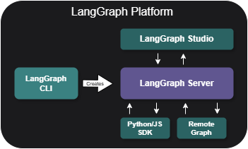

# 🦜🕸️ Awesome LangGraph 

> A curated list of awesome projects, resources, and tools for building stateful, multi-actor applications with [LangGraph](https://github.com/langchain-ai/langgraph).

**Welcome to Awesome LangGraph!** This repository is your go-to resource for discovering tools, templates, and examples for building powerful AI applications with LangGraph. Whether you're just getting started or building production-ready systems, you'll find valuable resources to accelerate your development.

## Table of Contents

- [Core Ecosystem](#core-ecosystem)
  - [LangChain Ecosystem Overview](#langchain-ecosystem-overview)
  - [LangGraph Platform](#langgraph-platform)
- [Official Resources](#official-resources)
  - [Starter Templates](#starter-templates)
  - [Pre-built Agents](#pre-built-agents)
  - [Example Applications](#example-applications)
- [Integration & Development Tools](#integration-development-tools)
  - [LangGraph Development Tools](#langgraph-development-tools)
  - [Third-Party Packages](#third-party-packages)
  - [Database & Backend Integration](#database-backend-integration)
  - [Frontend & UI Integration](#frontend-ui-integration)
- [Community Projects](#community-projects)
  - [AI Assistants & Agents](#ai-assistants--agents)
  - [Development Tools](#development-tools-1)
  - [Content & Media](#content--media)
  - [Knowledge & Retrieval](#knowledge--retrieval)
  - [Finance & Business](#finance--business)
  - [Sustainability](#sustainability)
- [Learning Resources](#learning-resources)
  - [Courses](#courses)
  - [Tutorials & Examples](#tutorials--examples)
- [Companies Using LangGraph](#companies-using-langgraph)
- [Contributing](#contributing)
- [Acknowledgments](#acknowledgments)

### LangChain Ecosystem

#### Overview

LangGraph extends the LangChain ecosystem to provide flexible orchestration for LLM-powered systems. The ecosystem consists of several key components working together to support the entire LLM application lifecycle:

#### Core Components

<strong>LangChain (OSS)</strong>

- Foundation framework for LLM application development
- Provides standardized interfaces for LLMs and related technologies
- Includes extensive integrations with embedding models and vector stores
- Features reusable components for chains, agents, and memory systems

📚 Documentation: [Python](https://python.langchain.com/docs/introduction/) | [TypeScript](https://js.langchain.com/docs/introduction/)

<strong>LangGraph (OSS)</strong>

- Built on top of LangChain for advanced workflow orchestration
- Enables building stateful, multi-agent systems
- Provides first-class streaming support
- Includes built-in human-in-the-loop capabilities
- Supports complex agent interactions and coordination

📚 Documentation: [LangGraph Docs](https://python.langchain.com/docs/langgraph) | [TypeScript Docs](https://js.langchain.com/docs/introduction/)

<strong>LangSmith (Observability)</strong>

- Comprehensive observability and debugging platform
- Debugging and testing tools
- Playground for experimentation
- Prompt management and versioning
- Annotation and evaluation
- Performance monitoring
- Testing automation

📚 Documentation: [LangSmith Platform](https://smith.langchain.com/) | [LangSmith Docs](https://docs.smith.langchain.com/)

<strong>LangGraph Platform (Commercial)</strong>

- Production deployment and management solution
- API generation for LangGraph applications
- Deployment automation
- Scaling infrastructure
- Production monitoring

📚 Documentation: [Platform Overview](https://langchain-ai.github.io/langgraph/concepts/langgraph_platform/#overview)

More details about the platform components and features in the section below.

### LangGraph Platform

The LangGraph Platform provides tools and services for building, deploying, and managing production-grade applications:

<strong>LangGraph Server</strong>

- Opinionated API architecture for deploying agentic applications
- Built-in support for streaming, background runs, and task queues
- Horizontally scalable infrastructure
- Integrated monitoring with LangSmith

📚 Documentation: [Server Docs](https://langchain-ai.github.io/langgraph/concepts/langgraph_server/)

<strong>LangGraph Studio</strong>

- Visual IDE for development and debugging
- Real-time graph visualization
- Interactive testing environment
- Integrated debugging tools

📚 Documentation: [Studio Docs](https://langchain-ai.github.io/langgraph/concepts/langgraph_studio/)

<strong>LangGraph CLI</strong>

- Command-line interface for local development
- Project scaffolding and management
- Deployment automation
- Configuration management

📚 Documentation: [CLI Docs](https://langchain-ai.github.io/langgraph/concepts/langgraph_cli/)

<strong>LangGraph SDK</strong>

- Core development toolkit
- Graph construction and management
- State management utilities
- Integration helpers

📚 Documentation: [SDK Docs](https://langchain-ai.github.io/langgraph/concepts/sdk/)

<strong>Remote Graph</strong>

- Remote execution of deployed applications
- Seamless integration with deployed servers
- State synchronization
- Distributed execution support

📚 Documentation: [Remote Graph Guide](https://langchain-ai.github.io/langgraph/how-tos/use-remote-graph/)

---

## Official Resources

### Starter Templates

Templates to help you get started with LangGraph. For deployment instructions, check out the [LangGraph CLI Documentation](https://langchain-ai.github.io/langgraph/cloud/reference/cli/).

| Template | Description |  |  |
|----------|-------------|---------|------------|
| **New Project** | Basic chatbot with memory | [langchain-ai/new-langgraph-project](https://github.com/langchain-ai/new-langgraph-project)  | [langchain-ai/new-langgraphjs-project](https://github.com/langchain-ai/new-langgraphjs-project)  |
| **ReAct Agent** | Tool-using agent framework | [langchain-ai/react-agent](https://github.com/langchain-ai/react-agent)  | [langchain-ai/react-agent-js](https://github.com/langchain-ai/react-agent-js)  |
| **Memory Agent** | Cross-thread memory persistence | [langchain-ai/memory-agent](https://github.com/langchain-ai/memory-agent)  | [langchain-ai/memory-agent-js](https://github.com/langchain-ai/memory-agent-js)  |
| **Retrieval Agent** | Knowledge-based QA system | [langchain-ai/retrieval-agent-template](https://github.com/langchain-ai/retrieval-agent-template)  | [langchain-ai/retrieval-agent-template-js](https://github.com/langchain-ai/retrieval-agent-template-js)  |
| **Data Enrichment** | Web search & data organization | [langchain-ai/data-enrichment](https://github.com/langchain-ai/data-enrichment)  | [langchain-ai/data-enrichment-js](https://github.com/langchain-ai/data-enrichment-js)  |

Each badge links to the respective GitHub repository. For deployment and configuration details, refer to the CLI documentation.

---
### Pre-built Agents

LangGraph comes with a built-in React agent pattern, and the community has developed numerous additional agent libraries. Below are some of the most popular community-built options that extend LangGraph's functionality in various ways.

These libraries are sorted by popularity (GitHub stars) and are actively maintained:

#### High-Level Frameworks
- **[trustcall](https://github.com/hinthornw/trustcall)** - Tenacious tool calling built on LangGraph 
- **[langchain-mcp-adapters](https://github.com/langchain-ai/langchain-mcp-adapters)** - Make Anthropic MCP tools compatible with LangGraph agents 
- **[langgraph-supervisor](https://github.com/langchain-ai/langgraph-supervisor-py)** - Build supervisor multi-agent systems with LangGraph 

#### Agent Capabilities
- **[langmem](https://github.com/langchain-ai/langmem)** - Build agents that learn and adapt from interactions over time 
- **[langgraph-swarm](https://github.com/langchain-ai/langgraph-swarm-py)** - Build swarm-style multi-agent systems using LangGraph 
- **[langgraph-CodeAct](https://github.com/langchain-ai/langgraph-codeact)** - Advanced function-calling architecture with code generation and execution 
- **[langgraph-reflection](https://github.com/langchain-ai/langgraph-reflection)** - Agent architecture with self-review capabilities 
- **[langgraph-bigtool](https://github.com/langchain-ai/langgraph-bigtool)** - Build agents with large numbers of tools 

#### Domain-Specific Agents
- **[open-deep-research](https://github.com/langchain-ai/open_deep_research)** - Open source assistant for iterative web research and report writing 
- **[ai-data-science-team](https://github.com/business-science/ai-data-science-team)** - AI-powered data science team for common tasks 
- **[delve-taxonomy-generator](https://github.com/andrestorres123/delve)** - A taxonomy generator for unstructured data 
- **[nodeology](https://github.com/xyin-anl/Nodeology)** - Scientific workflow builder with simplified interface 
- **[breeze-agent](https://github.com/andrestorres123/breeze-agent)** - Streamlined research system inspired by STORM 

Want to contribute your own pre-built agent? Check out the [contribution guidelines](https://langchain-ai.github.io/langgraph/prebuilt/#-contributing-your-library) in the documentation. 

---
### Example Applications

Reference applications built with LangGraph:

- **[ChatLangChain](https://github.com/langchain-ai/chat-langchain)** - LangChain documentation assistant  
- **[Open Canvas](https://github.com/langchain-ai/open-canvas)** - Document & code writing interface 
- **[OpenGPTs](https://github.com/langchain-ai/opengpts)** - Open source GPTs alternative  
- **[Email Assistant](https://github.com/langchain-ai/executive-ai-assistant)** - Email management automation  
- **[Social Media Agent](https://github.com/langchain-ai/social-media-agent)** - Content curation & scheduling  
- **[Agent Inbox](https://github.com/langchain-ai/agent-inbox)** - Human-in-the-loop UI  
- **[Full-Stack Python Chatbot](https://github.com/langchain-ai/langgraph-fullstack-python)** - React-style agent with a modern web UI, all hosted within a single LangGraph deployment  
- **[Generative UI Examples](https://github.com/langchain-ai/langgraphjs-gen-ui-examples)** - Collection of agents with generative UI components including stockbroker, trip planner, and email assistant 

---

## Integration & Development Tools

### LangGraph Development Tools
- **[LangGraph Builder](https://github.com/langchain-ai/langgraph-builder)** – Visual canvas for designing cognitive architectures of LangGraph applications with code generation for Python and TypeScript 
- **[LangGraph Generator](https://github.com/langchain-ai/langgraph-gen-py)** – CLI tool for generating LangGraph application stubs from YAML specifications 

### Third-Party Packages
- **[Python Provider Integrations](https://python.langchain.com/docs/integrations/providers/all/)** - Comprehensive list of all available integrations for Python, including LLM providers, vector stores, and tools
- **[JavaScript Provider Integrations](https://js.langchain.com/docs/integrations/platforms/)** - Available integrations for JavaScript/TypeScript applications

#### Database & Backend Integration
- **[Google GenAI Toolbox](https://github.com/googleapis/genai-toolbox)** – Production-grade infrastructure for connecting AI agents with databases, featuring security, observability, and connection pooling 

#### Frontend & UI Integration
- **[CopilotKit](https://github.com/CopilotKit/CopilotKit)** – Framework for building AI copilots with generative UI, chat interfaces, and human-in-the-loop capabilities 

---

## Community Projects

This is a curated list of open-source agent and LLM projects. They are grouped by category for easier discovery.

### AI Assistants
- **[AI-Data-Analysis-MultiAgent](https://github.com/starpig1129/AI-Data-Analysis-MultiAgent)** – Multi-agent system for data analysis, visualization, and report generation. 
- **[AI Coding Assistant](https://github.com/AbhinavTheDev/coding-agent)** – Development tool that uses LangGraph agents to aid coding workflow with natural language. 
- **[Brainstormers](https://github.com/Azzedde/brainstormers)** – Tool with curated, optimized chains for brainstorming using real-world techniques. 
- **[Clevrr Computer](https://github.com/Clevrr-AI/Clevrr-Computer)** – Automation agent for basic computer tasks with a focus on safety and accuracy. 
- **[ContentMind AI](https://github.com/lgesuellip/researcher_agent)** – Turns websites into LLM-ready research content with automated documentation indexing. 
- **[CopilotMate](https://github.com/AkashJana18/copilotmate)** – Personal assistant with a Groq LLM and CopilotKit UI. 
- **[RD-Agent](https://github.com/microsoft/RD-Agent)** – Microsoft's R&D automation tool for data mining, paper analysis, and model tuning. 
- **[WebRover](https://github.com/hrithikkoduri/WebRover)** – Autonomous AI agent for automating web tasks and research. 
- **[AI Conversation Simulator](https://github.com/sanjeed5/ai-conversation-simulator)** – Test and develop AI assistants through simulated conversations with configurable personas and LangSmith integration 
- **[SurfSense](https://github.com/MODSetter/SurfSense)** – Customizable AI research agent that integrates personal knowledge bases with external sources like Tavily, Slack, and Notion 
- **[RAI](https://github.com/RobotecAI/rai)** – Flexible multi-agent framework for developing and deploying Embodied AI features in robotics with multi-modal interaction support 

### Content & Media
- **[AgentWrite](https://github.com/denser-org/denser-chat)** – Automated content generation tool that breaks down writing tasks. 
- **[Podcastfy.ai](https://github.com/souzatharsis/podcastfy)** – Transforms multi-modal content into audio conversations in multiple languages. 
- **[Robo-blogger](https://github.com/langchain-ai/robo-blogger)** – Voice-to-content pipeline for converting spoken ideas into structured blog posts. 
- **[Social Media Agent](https://github.com/langchain-ai/social-media-agent)** – Generates Twitter & LinkedIn posts from URLs with optional human review. 
- **[YT Navigator](https://github.com/wassim249/YT-Navigator)** – AI-powered tool for efficient navigation and search through YouTube channel content 

### Development & Tools
- **[AI Agent Service Toolkit](https://github.com/JoshuaC215/agent-service-toolkit)** – Framework for deploying AI agents with FastAPI and Streamlit. 
- **[Browser Use: Web AI](https://github.com/browser-use/browser-use)** – Library for AI agents to interact with websites and automate web tasks. 
- **[Khoj](https://github.com/khoj-ai/khoj)** – Self-hostable AI second brain for web or docs with custom agents. 
- **[Hyperbolic-AgentKit](https://github.com/HyperbolicLabs/Hyperbolic-AgentKit)** – AI agent framework with blockchain and compute features. 
- **[Agent Protocol](https://github.com/langchain-ai/agent-protocol)** – Codified, framework-agnostic APIs for serving LLM agents in production. 
- **[SRAgent](https://github.com/ArcInstitute/SRAgent)** – Multi-agent framework for automating genomic research and RNA sequencing workflows from scientific databases. 

### Finance & Business
- **[AI Case Study Analyzer](https://github.com/muratcankoylan/AI-Investigator)** – Discovers and analyzes AI case studies using Claude 3.5 Sonnet. 
- **[AI Hedge Fund](https://github.com/virattt/ai-hedge-fund)** – Group of six AI agents collaborating through LangChain for trading decisions. 
- **[gotoHuman Lead Agent](https://github.com/gotohuman/gotohuman-langgraph-lead-example)** – AI-powered sales automation for personalized emails with human oversight. 

---

### Knowledge & Retrieval
- **[bRAG](https://github.com/bRAGAI/bRAG-langchain)** – Tutorial series on RAG (Retrieval Augmented Generation) from basics to advanced. 
- **[Demo Bank Support Bot](https://github.com/multinear-demo/demo-bank-support-lc-py)** – RAG-powered banking support chatbot designed to prevent hallucinations. 
- **[Denser Chat](https://github.com/denser-org/denser-chat)** – Chatbot that answers questions from PDFs and webpages with text extraction. 
- **[IdentityRAG Insights](https://github.com/tilotech/identity-rag-customer-insights-chatbot)** – Chatbot that merges customer data into golden records for context-aware replies. 
- **[King RAGent](https://github.com/alonlavian/RAGent)** – AI research assistant with PDF processing, vector storage, and web search integration. 
- **[Reply gAI](https://github.com/langchain-ai/reply_gAI)** – AI clone for X/Twitter profiles with long-term memory and RAG. 
- **[Shandu](https://github.com/jolovicdev/shandu)** – LLM-based research system that automates source evaluation and knowledge synthesis. 
- **[Local Deep Research](https://github.com/LearningCircuit/local-deep-research)** – Privacy-focused research assistant performing deep analysis using multiple LLMs and web searches with local execution capability 
- **[GPT Researcher](https://github.com/assafelovic/gpt-researcher)** – Open deep research agent producing detailed reports with citations, using Plan-and-Solve and RAG techniques 

### Sustainability
- **[GreenMe](https://github.com/vivek-suryavanshi/GreenMeGenAIApp)** – AI sustainability guide that analyzes lifestyle for carbon footprint reduction. 

---

## Learning Resources

### Courses
- **[Introduction to LangGraph](https://academy.langchain.com/courses/intro-to-langgraph)** - Official course covering fundamentals and practical use cases 
- **[LangGraph - Develop LLM powered AI agents](https://www.udemy.com/course/langgraph/)** - Course on building AI agents with LangGraph by Eden Marco

### Tutorials & Examples
- **[GenAI_Agents](https://github.com/NirDiamant/GenAI_Agents)** - Agent implementation examples 
- **[RAG_Techniques](https://github.com/NirDiamant/RAG_Techniques)** - Several RAG implementations and tutorials 
- **[Grounding RAG Applications Workshop](https://github.com/carlyrichmond/webdevcon-grounding-rag-applications-workshop)** - Hands-on workshop building RAG chatbots and travel planning agents with JavaScript and Elasticsearch 

---

## Companies Using LangGraph

A comprehensive list of organizations using LangGraph in production environments. For more details and case studies, visit the [official adopters page](https://langchain-ai.github.io/langgraph/adopters/).

| Company | Industry | Use Case | Reference |
|---------|----------|----------|-----------|
| [LinkedIn](https://www.linkedin.com/) | Social Media | Code generation; Search & discovery | [Blog post, 2025](https://www.linkedin.com/blog/engineering/ai/practical-text-to-sql-for-data-analytics) |
| [Uber](https://www.uber.com/) | Transportation | Developer productivity; Code generation | [Presentation, 2024](https://dpe.org/sessions/ty-smith-adam-huda/this-year-in-ubers-ai-driven-developer-productivity-revolution/) |
| [GitLab](https://about.gitlab.com/) | Software & Technology | Code generation | [Duo workflow docs](https://handbook.gitlab.com/handbook/engineering/architecture/design-documents/duo_workflow/) |
| [Klarna](https://www.klarna.com/) | Fintech | Copilot for domain-specific task | [Case study, 2025](https://blog.langchain.dev/customers-klarna/) |
| [Rakuten](https://www.rakuten.com/) | E-commerce / Fintech | Copilot for domain-specific task | [Blog post, 2025](https://rakuten.today/blog/from-ai-hype-to-real-world-tools-rakuten-teams-up-with-langchain.html) |
| [Minimal](https://gominimal.ai/) | E-commerce | Customer support | [Case study, 2025](https://blog.langchain.dev/how-minimal-built-a-multi-agent-customer-support-system-with-langgraph-langsmith/) |
| [Komodo Health](https://www.komodohealth.com/) | Healthcare | Copilot for domain-specific task | [Blog post](https://www.komodohealth.com/perspectives/new-gen-ai-assistant-empowers-the-enterprise/) |
| [OpenRecovery](https://www.openrecovery.com/) | Healthcare | Copilot for domain-specific task | [Case study, 2024](https://blog.langchain.dev/customers-openrecovery/) |
| [AppFolio](https://www.appfolio.com/) | Real Estate | Copilot for domain-specific task | [Case study, 2024](https://blog.langchain.dev/customers-appfolio/) |
| [Cisco Outshift](https://outshift.cisco.com/) | Software & Technology | DevOps | [Blog post, 2025](https://outshift.cisco.com/blog/build-react-agent-application-for-devops-tasks-using-rest-apis) |
| [Elastic](https://www.elastic.co/) | Software & Technology | Copilot for domain-specific task | [Blog post, 2025](https://www.elastic.co/blog/elastic-security-generative-ai-features) |
| [Infor](https://infor.com/) | Software & Technology | GenAI embedded product experiences; customer support; copilot | [Case study, 2025](https://blog.langchain.dev/customers-infor/) |
| [AirTop](https://www.airtop.ai/) | Software & Technology (GenAI Native) | Browser automation for AI agents | [Case study, 2024](https://blog.langchain.dev/customers-airtop/) |
| [Athena Intelligence](https://www.athenaintel.com/) | Software & Technology (GenAI Native) | Research & summarization | [Case study, 2024](https://blog.langchain.dev/customers-athena-intelligence/) |
| [Captide](https://www.captide.co/) | Software & Technology (GenAI Native) | Data extraction | [Case study, 2025](https://blog.langchain.dev/how-captide-is-redefining-equity-research-with-agentic-workflows-built-on-langgraph-and-langsmith/) |

---

## Contributing

**We welcome contributions to this awesome list! Please ensure your submission**:

- Is actively maintained and relevant to LangGraph
- Includes a clear description of its purpose and value
- Follows the existing format and style
- Is placed in the appropriate category

To contribute:
1. Fork the repository
2. Add your project following the established format
3. Create a pull request with a brief explanation

For questions or suggestions, please open an issue.

---

## Acknowledgments

Special thanks to the LangChain team for building such an amazing framework and ecosystem that enables developers to create powerful AI applications. 
> This list is inspired by [awesome-langchain](https://github.com/kyrolabs/awesome-langchain), which has been a great resource for the community.

---

