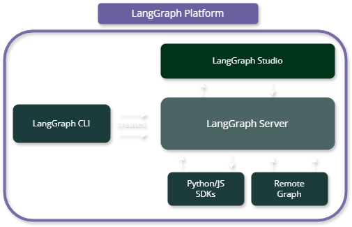

# 🦜🕸️ Awesome LangGraph  

> A curated list of awesome projects, resources, and tools for building stateful, multi-actor applications with [LangGraph](https://github.com/langchain-ai/langgraph).

**Welcome to Awesome LangGraph!** This repository is your go-to resource for discovering tools, templates, and examples for building powerful AI applications with LangGraph. Whether you're just getting started or building production-ready systems, you'll find valuable resources to accelerate your development.

## Table of Contents

- [Core Ecosystem](#core-ecosystem)
  - [LangChain Ecosystem](#langchain-ecosystem)
    - [Overview](#overview)
    - [Core Components](#core-components)
  - [LangGraph Platform](#langgraph-platform)
- [Official Resources](#official-resources)
  - [Starter Templates](#starter-templates)
  - [Pre-built Agents](#pre-built-agents)
  - [Example Applications](#example-applications)
  - [Development Tools](#development-tools)
    - [LLM Documentation Files](#llm-documentation-files)
    - [Third-Party Packages](#third-party-packages)
- [Community Projects](#community-projects)
  - [Community Pre-built Agents](#community-pre-built-agents)
  - [AI Assistants](#ai-assistants)
  - [Development & Tools](#development--tools)
  - [Content & Media](#content--media)
  - [Knowledge & Retrieval](#knowledge--retrieval)
  - [Finance & Buisness](#finance--buisness)
  - [Sustainability](#sustainability)
- [Learning Resources](#learning-resources)
  - [Courses](#courses)
  - [Tutorials & Examples](#tutorials--examples)
- [Companies Using LangGraph](#companies-using-langgraph)
- [Contributing](#contributing)
- [Acknowledgments](#acknowledgments)

### LangChain Ecosystem

#### Overview

LangGraph extends the LangChain ecosystem to provide flexible orchestration for LLM-powered systems. The ecosystem consists of several key components working together to support the entire LLM application lifecycle:

  
  
Source: <a href="https://python.langchain.com/docs/introduction/">LangChain Documentation</a>

#### Core Components

<strong>LangChain</strong>

- Foundation framework for LLM application development
- Provides standardized interfaces for LLMs and related technologies
- Includes extensive integrations with embedding models and vector stores
- Features reusable components for chains, agents, and memory systems

📚 Documentation: [Python](https://python.langchain.com/docs/introduction/) | [TypeScript](https://js.langchain.com/docs/introduction/)

<strong>LangGraph </strong>

- Built on top of LangChain for advanced workflow orchestration
- Enables building stateful, multi-agent systems
- Provides first-class streaming support
- Includes built-in human-in-the-loop capabilities
- Supports complex agent interactions and coordination

📚 Documentation: [LangGraph Docs](https://python.langchain.com/docs/langgraph) | [TypeScript Docs](https://js.langchain.com/docs/introduction/)

<strong>LangSmith </strong>

- Comprehensive observability and debugging platform
- Debugging and testing tools
- Playground for experimentation
- Prompt management and versioning
- Annotation and evaluation
- Performance monitoring
- Testing automation

📚 Documentation: [LangSmith Platform](https://smith.langchain.com/) | [LangSmith Docs](https://docs.smith.langchain.com/)

<strong>LangGraph Platform </strong>

- Production deployment and management solution
- API generation for LangGraph applications
- Deployment automation
- Scaling infrastructure
- Production monitoring

📚 Documentation: [Platform Overview](https://langchain-ai.github.io/langgraph/concepts/langgraph_platform/#overview)

More details about the platform components and features in the section below.

### LangGraph Platform

The LangGraph Platform provides tools and services for building, deploying, and managing production-grade applications:

  
  
Source: <a href="https://langchain-ai.github.io/langgraph/concepts/langgraph_platform/#overview">LangGraph Platform Documentation</a>

<strong>LangGraph Server</strong>

- Opinionated API architecture for deploying agentic applications
- Built-in support for streaming, background runs, and task queues
- Horizontally scalable infrastructure
- Integrated monitoring with LangSmith

📚 Documentation: [Server Docs](https://langchain-ai.github.io/langgraph/concepts/langgraph_server/)

<strong>LangGraph Studio</strong>

- Visual IDE for development and debugging
- Real-time graph visualization
- Interactive testing environment
- Integrated debugging tools

📚 Documentation: [Studio Docs](https://langchain-ai.github.io/langgraph/concepts/langgraph_studio/)

<strong>LangGraph CLI</strong>

- Command-line interface for local development
- Project scaffolding and management
- Deployment automation
- Configuration management

📚 Documentation: [CLI Docs](https://langchain-ai.github.io/langgraph/concepts/langgraph_cli/)

<strong>LangGraph SDK</strong>

- Core development toolkit
- Graph construction and management
- State management utilities
- Integration helpers

📚 Documentation: [SDK Docs](https://langchain-ai.github.io/langgraph/concepts/sdk/)

<strong>Remote Graph</strong>

- Remote execution of deployed applications
- Seamless integration with deployed servers
- State synchronization
- Distributed execution support

📚 Documentation: [Remote Graph Guide](https://langchain-ai.github.io/langgraph/how-tos/use-remote-graph/)

---

## Official Resources

Official templates, tools, and libraries maintained by LangChain and LangGraph teams.

### Starter Templates

Templates to help you get started with LangGraph. For deployment instructions, check out the [LangGraph CLI Documentation](https://langchain-ai.github.io/langgraph/cloud/reference/cli/).

| Template | Description |  |  |
|----------|-------------|---------|------------|
| **New Project** | Basic chatbot with memory | [langchain-ai/new-langgraph-project](https://github.com/langchain-ai/new-langgraph-project)  | [langchain-ai/new-langgraphjs-project](https://github.com/langchain-ai/new-langgraphjs-project)  |
| **ReAct Agent** | Tool-using agent framework | [langchain-ai/react-agent](https://github.com/langchain-ai/react-agent) | [langchain-ai/react-agent-js](https://github.com/langchain-ai/react-agent-js)  |
| **Memory Agent** | Cross-thread memory persistence | [langchain-ai/memory-agent](https://github.com/langchain-ai/memory-agent) | [langchain-ai/memory-agent-js](https://github.com/langchain-ai/memory-agent-js)  |
| **Retrieval Agent** | Knowledge-based QA system | [langchain-ai/retrieval-agent-template](https://github.com/langchain-ai/retrieval-agent-template)  | [langchain-ai/retrieval-agent-template-js](https://github.com/langchain-ai/retrieval-agent-template-js) |
| **Data Enrichment** | Web search & data organization | [langchain-ai/data-enrichment](https://github.com/langchain-ai/data-enrichment) | [langchain-ai/data-enrichment-js](https://github.com/langchain-ai/data-enrichment-js)  |

---
### Pre-built Agents

LangGraph comes with a built-in React agent pattern, and the community has developed numerous additional agent libraries. Below are some of the most popular community-built options that extend LangGraph's functionality in various ways.

These are the official agents provided and maintained by LangGraph:

| Agent | Description |  |  |
|-------|-------------|---------|------------|
| **Computer Use Agent** | Agent for automating computer interactions and tasks | [langgraph-cua-py](https://github.com/langchain-ai/langgraph-cua-py) | [langgraph-cua](https://github.com/langchain-ai/langgraphjs/tree/main/libs/langgraph-cua) |
| **Swarm Agent** | Build swarm-style multi-agent systems | [langgraph-swarm-py](https://github.com/langchain-ai/langgraph-swarm-py) | [langgraph-swarm](https://github.com/langchain-ai/langgraphjs/tree/main/libs/langgraph-swarm) |
| **Supervisor** | Build supervisor multi-agent systems | [langgraph-supervisor-py](https://github.com/langchain-ai/langgraph-supervisor-py) | [langgraph-supervisor](https://github.com/langchain-ai/langgraphjs/tree/main/libs/langgraph-supervisor) |
| **MCP Adapters** | Make Anthropic MCP tools compatible with agents | [langchain-mcp-adapters](https://github.com/langchain-ai/langchain-mcp-adapters) | ❌ |
| **LangMem** | Agents that learn and adapt from interactions | [langmem](https://github.com/langchain-ai/langmem) | ❌ |
| **CodeAct** | Advanced function-calling with code generation | [langgraph-codeact](https://github.com/langchain-ai/langgraph-codeact) | ❌ |
| **Reflection** | Agent architecture with self-review capabilities | [langgraph-reflection](https://github.com/langchain-ai/langgraph-reflection) | ❌ |
| **BigTool** | Build agents with large numbers of tools | [langgraph-bigtool](https://github.com/langchain-ai/langgraph-bigtool) | ❌ |

---
### Example Applications

These applications demonstrate real-world implementations using LangGraph. From chatbots to content generation, each example showcases different patterns and best practices for building production-ready systems and can be deployed with LanGraph Cloud.

You can use these as reference architectures or starting points for your own projects.

| Name | Description |
|------|-------------|
| [Open Agent Platform](https://github.com/langchain-ai/open-agent-platform)  | No-code platform for building customizable agents with MCP tools integration, LangConnect RAG support, and multi-agent supervision capabilities. Features a modern web interface and pre-built agent templates. |
| [LangConnect](https://github.com/langchain-ai/langconnect)  | Managed RAG service with FastAPI and PostgreSQL/pgvector integration, featuring document collection management, semantic search, and Docker deployment support. |
| [ChatLangChain](https://github.com/langchain-ai/chat-langchain) | Documentation assistant powered by RAG-based semantic search with intelligent query analysis. Features automated content indexing, duplicate prevention, GenUI, and sophisticated document tracking system. |
| [OpenGPTs](https://github.com/langchain-ai/opengpts)  | Open-source GPT alternative supporting 60+ LLM providers and tools. Implements three cognitive architectures (Assistant, RAG, Chatbot) with PostgreSQL backend and flexible deployment options. |
| [Executive AI Assistant](https://github.com/langchain-ai/executive-ai-assistant)  | Smart email management system with calendar integration. Provides intelligent triage, automated response drafting, and meeting coordination through Gmail API with customizable workflows. |
| [Agent Inbox](https://github.com/langchain-ai/agent-inbox)  | Centralized interface for AI agent interactions featuring real-time communication, interrupt handling, and configurable response systems for both local and cloud deployments. |
| [Python Fullstack](https://github.com/langchain-ai/langgraph-fullstack-python)  | All-in-one chatbot template combining React-style agents with modern UI. Built with FastHTML components and Claude 3, featuring single-deployment architecture and extensible tools. |
| [LangGraph UI Examples](https://github.com/langchain-ai/langgraphjs-gen-ui-examples)  | Showcase of generative UI agents including stockbroker, trip planner, and email tools. Demonstrates human-in-the-loop workflows with customizable components and tool integrations. |
| [LangChain Next.js](https://github.com/langchain-ai/langchain-nextjs-template)  | Next.js starter template showcasing LangChain.js modules. Includes streaming chat, structured output, multi-step agents, and RAG implementations with Vercel AI SDK integration. |
| [Custom Auth](https://github.com/langchain-ai/custom-auth)  | Supabase-powered authentication template for LangGraph deployments. Implements OAuth2 with Google, user management, and secure chatbot access with conversation thread isolation. |
| [Gen UI Computer Use](https://github.com/bracesproul/gen-ui-computer-use)  | A Generative UI web app for interacting with Computer Use Agents (CUA) via the `@langchain/langgraph-cua` prebuilt package. Features a modern interface for computer automation and task management. |
| [Multi-Modal Researcher](https://github.com/langchain-ai/multi-modal-researcher)  | Research and podcast generation workflow using LangGraph with Gemini 2.5 model family. Features video understanding, Google search integration, and multi-speaker text-to-speech for creating comprehensive research reports and audio podcasts. |
| [Deep Agents UI](https://github.com/langchain-ai/deep-agents-ui)  | Next.js interface for Deep Agents with streaming support and LangGraph Platform integration. Generic AI agents capable of handling tasks of varying complexity with customizable UI components. |

---

### Development Tools
LangGraph provides official development tools to streamline your workflow, from visual design to code generation. These tools help you build and deploy LangGraph applications more efficiently.

- **[LangGraph Builder](https://github.com/langchain-ai/langgraph-builder)** – Visual canvas for designing cognitive architectures of LangGraph applications with code generation for Python and TypeScript 
- **[LangGraph Generator](https://github.com/langchain-ai/langgraph-gen-py)** – CLI tool for generating LangGraph application stubs from YAML specifications 

#### LLM Documentation Files
Access official documentation in LLM-readable formats, enabling LLMs and agents to understand and work with the frameworks, particularly within integrated development environments (IDEs). Learn more in the [official documentation](https://langchain-ai.github.io/langgraph/llms-txt-overview/).

| Framework | Index File | Full Documentation |
|-----------|------------|-------------------|
| LangGraph Python | [llms.txt](https://langchain-ai.github.io/langgraph/llms.txt) | [llms-full.txt](https://langchain-ai.github.io/langgraph/llms-full.txt) |
| LangGraph JS | [llms.txt](https://langchain-ai.github.io/langgraphjs/llms.txt) | [llms-full.txt](https://langchain-ai.github.io/langgraphjs/llms-full.txt) |
| LangChain Python | [llms.txt](https://python.langchain.com/llms.txt) | - |
| LangChain JS | [llms.txt](https://js.langchain.com/llms.txt) | - |

The `llms.txt` files serve as lightweight indexes for quick reference, while `llms-full.txt` provides comprehensive documentation for deeper understanding and integration.

#### Third-Party Packages
Ready-to-use integrations for extending LangGraph with external services and tools. Access everything from LLMs, vector stores to databases to development tools.

🔗 [Python Packages](https://python.langchain.com/docs/integrations/providers/all/)  | 🔗 [JavaScript Packages](https://js.langchain.com/docs/integrations/platforms/) 
## Community Projects

This is a curated list of open-source agent and LLM projects. They are grouped by category for easier discovery.

### Community Pre-built Agents
- **[TrustCall](https://github.com/hinthornw/trustcall)** - Tenacious tool calling built on LangGraph 
- **[Data Science Team](https://github.com/business-science/ai-data-science-team)** - AI-powered data science team for common tasks 
- **[Delve](https://github.com/andrestorres123/delve)** - A taxonomy generator for unstructured data 
- **[Nodeology](https://github.com/xyin-anl/Nodeology)** - Enable researcher to build scientific workflows easily with simplified interface 
- **[Breeze Agent](https://github.com/andrestorres123/breeze-agent)** - A streamlined research system built inspired on STORM and built on LangGraph 

Want to contribute your own pre-built agent? Check out the [contribution guidelines](https://langchain-ai.github.io/langgraph/prebuilt/#-contributing-your-library) in the documentation.

### AI Assistants
- **[LlamaBot](https://github.com/KodyKendall/LlamaBot)** – Web development coding agent that helps create HTML/CSS/JavaScript projects, featuring game creation, portfolio websites, and business landing pages with LangGraph orchestration. 
- **[DeerFlow](https://github.com/bytedance/deer-flow)** – Community-driven deep research framework combining language models with specialized tools for web search, crawling, and Python execution, featuring interactive research planning and human-in-the-loop capabilities. 
- **[Telegram Link Summarizer Agent](https://github.com/kargarisaac/telegram_link_summarizer_agent)** – Agentic Telegram bot that summarizes links (articles, papers, tweets, LinkedIn posts, PDFs) shared in a channel using LangGraph orchestration, BAML integration, and multi-tool content extraction. 
- **[Voice File Agent](https://github.com/von-development/voice-file-agent)** – Voice-controlled file management system using LangGraph's ReAct agent, featuring natural language commands, OpenAI transcription, and ElevenLabs voice feedback. 
- **[Tavily Meeting Prep Agent](https://github.com/tavily-ai/meeting-prep-agent)** – Advanced meeting preparation system combining calendar integration, real-time web search, and profile research capabilities with MCP and ReAct agent flows. 
- **[AI-Data-Analysis-MultiAgent](https://github.com/starpig1129/AI-Data-Analysis-MultiAgent)** – Multi-agent system for data analysis, visualization, and report generation. 
- **[AI Coding Assistant](https://github.com/AbhinavTheDev/coding-agent)** – Development tool that uses LangGraph agents to aid coding workflow with natural language. 
- **[Brainstormers](https://github.com/Azzedde/brainstormers)** – Tool with curated, optimized chains for brainstorming using real-world techniques. 
- **[Clevrr Computer](https://github.com/Clevrr-AI/Clevrr-Computer)** – Automation agent for basic computer tasks with a focus on safety and accuracy. 
- **[ContentMind AI](https://github.com/lgesuellip/researcher_agent)** – Turns websites into LLM-ready research content with automated documentation indexing. 
- **[CopilotKit](https://github.com/CopilotKit/CopilotKit)** – Framework for building AI copilots with generative UI, chat interfaces, and human-in-the-loop capabilities 
- **[RD-Agent](https://github.com/microsoft/RD-Agent)** – Microsoft's R&D automation tool for data mining, paper analysis, and model tuning. 
- **[WebRover](https://github.com/hrithikkoduri/WebRover)** – Autonomous AI agent for automating web tasks and research. 
- **[AI Conversation Simulator](https://github.com/sanjeed5/ai-conversation-simulator)** – Test and develop AI assistants through simulated conversations with configurable personas and LangSmith integration 
- **[SurfSense](https://github.com/MODSetter/SurfSense)** – Customizable AI research agent that integrates personal knowledge bases with external sources like Tavily, Slack, and Notion 
- **[RAI](https://github.com/RobotecAI/rai)** – Flexible multi-agent framework for developing and deploying Embodied AI features in robotics with multi-modal interaction support 
- **[Open Multi-Agent Canvas](https://github.com/CopilotKit/open-multi-agent-canvas)** – Dynamic chat interface for managing multiple agents in one conversation, featuring travel planning and research capabilities through MCP servers, built with Next.js and LangGraph. 
- **[InboxHero](https://github.com/zamalali/InboxHero)** – Smart email management assistant built with LangGraph that prioritizes messages, reads attachments, and drafts replies using ChatGroq, featuring interactive chat mode and customizable time frames. 
- **[Multi-Agent Medical Assistant](https://github.com/souvikmajumder26/Multi-Agent-Medical-Assistant)** – AI-powered multi-agent system for medical diagnosis, research, and patient interaction, featuring LLMs, RAG, and human-in-the-loop validation. 
- **[LangGraph WhatsApp Agent](https://github.com/lgesuellip/langgraph-whatsapp-agent)** – Template for building scalable WhatsApp AI agents with LangGraph, supporting multi-agent systems, image processing, and MCP integration. 
- **[Voice Agent Base](https://github.com/benjichat/voice_agent_base)** – Voice-enabled AI agent application with React interface, featuring speech-to-text via OpenAI Whisper, text-to-speech via ElevenLabs, and web search capabilities through Tavily integration. 
- **[AI Agent Smart Assist](https://github.com/raminmohammadi/ai-agent-smart-assist)** – LangChain-powered AI agent for text classification, knowledge base management, and intelligent Q&A. Features document ingestion with FAISS vector storage, smart text routing, and RAG-style question answering with a modern Next.js frontend and FastAPI backend. 
- **[Synapse Workflows](https://github.com/raj-maharajwala/AI_Agent_Chatbot_Synapse)** – Multi-agent platform with three specialized AI agents: Smart Search Agent for real-time web search, Productivity Assistant for task automation, and Data Analysis Agent for dataset insights and visualization. 
- **[ChuanhuChatGPT](https://github.com/GaiZhenbiao/ChuanhuChatGPT)** – Comprehensive GUI for ChatGPT API and multiple LLMs with agent support, file-based QA, web search integration, and GPT fine-tuning capabilities. Features auto-naming conversations, knowledge base functionality, and beautiful UI with PWA support. 

### Development & Tools
- **[Agentic AI Browser](https://github.com/esinecan/agentic-ai-browser)** – AI-driven web automation agent emphasizing intelligent design over brute force, featuring behavioral caching, DOM-based task fidelity, success pattern recording, and single-agent architecture for efficient browser automation. 
- **[SWE Agent](https://github.com/langtalks/swe-agent)** – AI-powered software engineering multi-agent system featuring researcher and developer agents that automate code implementation through intelligent planning, execution, and atomic task breakdown with LangGraph workflows. 
- **[ARMA](https://github.com/eosho/ARMA)** – Azure Resource Management Assistant built with LangGraph and LangChain, featuring multi-agent architecture for Azure resource provisioning, ARM template validation, and comprehensive resource management with Streamlit UI. 
- **[ScienceBridge](https://github.com/RichardKaranuMbuti/ScienceBridge)** – AI-powered scientific research accelerator that autonomously analyzes datasets, generates hypotheses, and validates them through code, featuring ML model integration and automated visualization. 
- **[AI Agent Service Toolkit](https://github.com/JoshuaC215/agent-service-toolkit)** – Framework for deploying AI agents with FastAPI and Streamlit. 
- **[Browser Use: Web AI](https://github.com/browser-use/browser-use)** – Library for AI agents to interact with websites and automate web tasks. 
- **[Khoj](https://github.com/khoj-ai/khoj)** – Self-hostable AI second brain for web or docs with custom agents. 
- **[Hyperbolic-AgentKit](https://github.com/HyperbolicLabs/Hyperbolic-AgentKit)** – AI agent framework with blockchain and compute features. 
- **[Agent Protocol](https://github.com/langchain-ai/agent-protocol)** – Codified, framework-agnostic APIs for serving LLM agents in production. 
- **[SRAgent](https://github.com/ArcInstitute/SRAgent)** – Multi-agent framework for automating genomic research and RNA sequencing workflows from scientific databases. 
- **[Google GenAI Toolbox](https://github.com/googleapis/genai-toolbox)** – Production-grade infrastructure for connecting AI agents with databases, featuring security, observability, and connection pooling 
- **[LangGraph MCP Agents](https://github.com/teddynote-lab/langgraph-mcp-agents)** – Toolkit for integrating Model Context Protocol (MCP) with LangGraph agents, featuring Streamlit interface, dynamic tool management, and real-time streaming responses. 
- **[LangManus](https://github.com/Darwin-lfl/langmanus)** – Community-driven AI automation framework combining language models with specialized tools for web search, crawling, and Python code execution. 
- **[FastAPI LangGraph Agent Template](https://github.com/wassim249/fastapi-langgraph-agent-production-ready-template)** – Production-ready FastAPI template for building AI agent applications with LangGraph integration, featuring high-performance async API endpoints, LLM observability, structured logging, PostgreSQL persistence, Docker support, and comprehensive security features. 
- **[Ryoma](https://github.com/project-ryoma/ryoma)**  – AI-powered data agent framework for data analysis, engineering, and visualization, combining LangChain, Reflex, Apache Arrow, and more. 
- **[FastAPI MCP LangGraph Template](https://github.com/NicholasGoh/fastapi-mcp-langgraph-template)** – Production-ready FastAPI template integrating LangGraph and MCP for agent orchestration, streaming UX, and database persistence. 
- **[ScrapeCraft](https://github.com/ScrapeGraphAI/scrapecraft)** – AI-powered web scraping editor with visual workflow builder using LangGraph and ScrapeGraphAI. Features natural language scraping pipeline creation, multi-URL bulk scraping, and real-time WebSocket streaming with Docker deployment. 

### Content & Media
- **[AgentWrite](https://github.com/denser-org/denser-chat)** – Automated content generation tool that breaks down writing tasks. 
- **[Podcastfy.ai](https://github.com/souzatharsis/podcastfy)** – Transforms multi-modal content into audio conversations in multiple languages. 
- **[Robo-blogger](https://github.com/langchain-ai/robo-blogger)** – Voice-to-content pipeline for converting spoken ideas into structured blog posts. 
- **[Social Media Agent](https://github.com/langchain-ai/social-media-agent)** – Generates Twitter & LinkedIn posts from URLs with optional human review. 
- **[YT Navigator](https://github.com/wassim249/YT-Navigator)** – AI-powered tool for efficient navigation and search through YouTube channel content 
- **[AI-Powered Podcast Creation](https://github.com/artnoage/Podcast)** – Automated workflow for creating engaging podcasts from academic texts using AI agents, featuring content summarization, script writing, and self-improving prompt optimization based on user feedback. 

### Knowledge & Retrieval
- **[Agentic-Qdrant-RAG](https://github.com/Goodnight77/Just-RAG/tree/main/Agentic-Qdrant-RAG)** – Agentic RAG system demonstrating LangGraph integration with Qdrant vector database for intelligent document retrieval and complex query processing. 
- **[II-Researcher](https://github.com/Intelligent-Internet/ii-researcher)** – Powerful deep search agent using BAML functions for intelligent web searches, featuring multi-provider web scraping, multi-step reasoning, and asynchronous operations with Tavily/SerpAPI integration. 
- **[RAG Challenge Winner](https://github.com/IlyaRice/RAG-Challenge-2)** – State-of-the-art RAG implementation featuring custom PDF parsing, vector search with parent retrieval, LLM reranking, and chain-of-thought reasoning for company report analysis. 
- **[RAGLight](https://github.com/Bessouat40/RAGLight)** – Lightweight and modular Python library for implementing Retrieval-Augmented Generation (RAG), Agentic RAG, and RAT (Retrieval Augmented Thinking). Features multi-provider LLM support (Ollama, LMStudio, OpenAI, Mistral), flexible embedding models, and both simple and agentic pipeline architectures. 
- **[Local Chat RAG](https://github.com/TAMustafa/Local_Chat_RAG)** – Privacy-first RAG chat application with local LLM support via Ollama, featuring document parsing, source citations, and a modern React frontend. 
- **[Company Research Agent](https://github.com/pogjester/company-research-agent)** – Multi-agent system for comprehensive company research using Gemini 2.0 Flash and GPT-4.1, featuring real-time progress streaming, AI-powered content filtering, and modular research pipeline. 
- **[bRAG](https://github.com/bRAGAI/bRAG-langchain)** – Tutorial series on RAG (Retrieval Augmented Generation) from basics to advanced. 
- **[DeepGit](https://github.com/zamalali/DeepGit)** – Advanced LangGraph-based agentic workflow for intelligent GitHub repository discovery, featuring hybrid dense retrieval, cross-encoder re-ranking, and comprehensive activity analysis. 
- **[AI PDF Chatbot](https://github.com/mayooear/ai-pdf-chatbot-langchain)** – Customizable template for building AI chatbots that process PDF documents using LangChain and LangGraph, featuring document ingestion, vector storage, and streaming responses. 
- **[Demo Bank Support Bot](https://github.com/multinear-demo/demo-bank-support-lc-py)** – RAG-powered banking support chatbot designed to prevent hallucinations. 
- **[Denser Chat](https://github.com/denser-org/denser-chat)** – Chatbot that answers questions from PDFs and webpages with text extraction. 
- **[IdentityRAG Insights](https://github.com/tilotech/identity-rag-customer-insights-chatbot)** – Chatbot that merges customer data into golden records for context-aware replies. 
- **[King RAGent](https://github.com/alonlavian/RAGent)** – AI research assistant with PDF processing, vector storage, and web search integration. 
- **[Reply gAI](https://github.com/langchain-ai/reply_gAI)** – AI clone for X/Twitter profiles with long-term memory and RAG. 
- **[Shandu](https://github.com/jolovicdev/shandu)** – LLM-based research system that automates source evaluation and knowledge synthesis. 
- **[Local Deep Research](https://github.com/LearningCircuit/local-deep-research)** – Privacy-focused research assistant performing deep analysis using multiple LLMs and web searches with local execution capability 
- **[GPT Researcher](https://github.com/assafelovic/gpt-researcher)** – Open deep research agent producing detailed reports with citations, using Plan-and-Solve and RAG techniques 
- **[Curie - Research Experimentation Agent](https://github.com/Just-Curieous/Curie)** - AI research agent to automate rigorous scientific experimentation and produce meaningful empirical results, driving discovery across ML, systems & more. 
- **[LangConnect-Client](https://github.com/teddynote-lab/LangConnect-Client)** – Streamlit-based RAG client with comprehensive document management and vector search capabilities. Features semantic/hybrid search, multi-format support (PDF/DOCX/MD), Supabase authentication, and MCP integration for AI assistants with PostgreSQL/pgvector backend. 
- **[Local Deep Search Academic](https://github.com/iblameandrew/local-deepsearch-academic)** – Academic research assistant that automates paper discovery using Semantic Scholar API, intelligent filtering, and RAPTOR indexing. Features conversational QA with local LLMs and professional report generation from research sessions. 

### Finance & Business
- **[Marketing Analyst Agent](https://github.com/oba2311/analyst_agent)** – AI-powered marketing analysis system built with LangChain, featuring market trend forecasting, sentiment analysis, campaign evaluation, and automated report generation with strategic recommendations. 
- **[AI Case Study Analyzer](https://github.com/muratcankoylan/AI-Investigator)** - Discovers and analyzes enterprise AI case studies. 
- **[AI Hedge Fund](https://github.com/virattt/ai-hedge-fund)** - Six AI agents collaborating through LangChain for smart trading decisions. 
- **[gotoHuman Lead Agent](https://github.com/gotohuman/gotohuman-langgraph-lead-example)** - AI-powered sales solution for automated personalized email drafting with human oversight. 
- **[AI Bank Statement Document Automation](https://github.com/johnsonhk88/AI-Bank-Statement-Document-Automation-By-LLM-And-Personal-Finanical-Analysis-Prediction)** – Automated bank statement processing system using LLM models for document extraction, RAG techniques, and personal financial analysis. Features OCR, computer vision, and multi-agent workflows for converting unstructured PDF documents into structured data with natural language querying capabilities. 
- **[DeepAgents Stock Research](https://github.com/sagar-n/deepagents)** – AI-powered stock research assistant using LangChain DeepAgents with specialized sub-agents for fundamental, technical, and risk analysis. Features real-time data integration, systematic research workflows, and professional investment reports with price targets. 
- **[AI IPO Analyst](https://github.com/AKMessi/AI-IPO-Analyst)** – Custom research AI agent for analyzing Indian IPOs using DRHP documents. Features automated PDF parsing, financial statement extraction, web-enabled market data enrichment, and comprehensive investment analysis reports with Streamlit interface. 

### Sustainability
- **[GreenMe](https://github.com/vivek-suryavanshi/GreenMeGenAIApp)** – AI sustainability guide that analyzes lifestyle for carbon footprint reduction. 

---

## Learning Resources

### Courses
- **[Introduction to LangGraph](https://academy.langchain.com/courses/intro-to-langgraph)** - Official course covering fundamentals and practical use cases.
- **[LangGraph - Develop LLM powered AI agents](https://www.udemy.com/course/langgraph/)** - Course on building AI agents with LangGraph by [@emarco177](https://github.com/@emarco177)

### Tutorials & Examples
- **[Ava WhatsApp Agent ](https://github.com/neural-maze/ava-whatsapp-agent-course)** - Course on building a  WhatsApp agent with LangGraph, featuring voice processing, image generation, and long-term memory.  
- **[GenAI Agents](https://github.com/NirDiamant/GenAI_Agents)** - Agent implementation examples 
- **[RAG Techniques](https://github.com/NirDiamant/RAG_Techniques)** - Several RAG implementations and tutorials 
- **[Grounding RAG Applications Workshop](https://github.com/carlyrichmond/webdevcon-grounding-rag-applications-workshop)** - Hands-on workshop building RAG chatbots and travel planning agents with JavaScript and Elasticsearch 

---

## Companies Using LangGraph

A comprehensive list of organizations using LangGraph in production environments. For more details and case studies, visit the [official adopters page](https://langchain-ai.github.io/langgraph/adopters/).

| Company | Industry | Use Case | Reference |
|---------|----------|----------|-----------|
| [LinkedIn](https://www.linkedin.com/) | Social Media | Code generation; Search & discovery | [Blog post, 2025](https://www.linkedin.com/blog/engineering/ai/practical-text-to-sql-for-data-analytics) |
| [Uber](https://www.uber.com/) | Transportation | Developer productivity; Code generation | [Presentation, 2024](https://dpe.org/sessions/ty-smith-adam-huda/this-year-in-ubers-ai-driven-developer-productivity-revolution/) |
| [GitLab](https://about.gitlab.com/) | Software & Technology | Code generation | [Duo workflow docs](https://handbook.gitlab.com/handbook/engineering/architecture/design-documents/duo_workflow/) |
| [Klarna](https://www.klarna.com/) | Fintech | Copilot for domain-specific task | [Case study, 2025](https://blog.langchain.dev/customers-klarna/) |
| [Rakuten](https://www.rakuten.com/) | E-commerce / Fintech | Copilot for domain-specific task | [Blog post, 2025](https://rakuten.today/blog/from-ai-hype-to-real-world-tools-rakuten-teams-up-with-langchain.html) |
| [Minimal](https://gominimal.ai/) | E-commerce | Customer support | [Case study, 2025](https://blog.langchain.dev/how-minimal-built-a-multi-agent-customer-support-system-with-langgraph-langsmith/) |
| [Komodo Health](https://www.komodohealth.com/) | Healthcare | Copilot for domain-specific task | [Blog post](https://www.komodohealth.com/perspectives/new-gen-ai-assistant-empowers-the-enterprise/) |
| [OpenRecovery](https://www.openrecovery.com/) | Healthcare | Copilot for domain-specific task | [Case study, 2024](https://blog.langchain.dev/customers-openrecovery/) |
| [AppFolio](https://www.appfolio.com/) | Real Estate | Copilot for domain-specific task | [Case study, 2024](https://blog.langchain.dev/customers-appfolio/) |
| [Cisco Outshift](https://outshift.cisco.com/) | Software & Technology | DevOps | [Blog post, 2025](https://outshift.cisco.com/blog/build-react-agent-application-for-devops-tasks-using-rest-apis) |
| [Elastic](https://www.elastic.co/) | Software & Technology | Copilot for domain-specific task | [Blog post, 2025](https://www.elastic.co/blog/elastic-security-generative-ai-features) |
| [Infor](https://infor.com/) | Software & Technology | GenAI embedded product experiences; customer support; copilot | [Case study, 2025](https://blog.langchain.dev/customers-infor/) |
| [AirTop](https://www.airtop.ai/) | Software & Technology (GenAI Native) | Browser automation for AI agents | [Case study, 2024](https://blog.langchain.dev/customers-airtop/) |
| [Athena Intelligence](https://www.athenaintel.com/) | Software & Technology (GenAI Native) | Research & summarization | [Case study, 2024](https://blog.langchain.dev/customers-athena-intelligence/) |
| [Captide](https://www.captide.co/) | Software & Technology (GenAI Native) | Data extraction | [Case study, 2025](https://blog.langchain.dev/how-captide-is-redefining-equity-research-with-agentic-workflows-built-on-langgraph-and-langsmith/) |

---

## Contributing

**We welcome contributions to this awesome list! Please ensure your submission**:

- Includes a clear description of its purpose and value
- Follows the existing format and style
- Is placed in the appropriate category

To contribute:
1. Fork the repository
2. Add your project following the established format
3. Create a pull request with a brief explanation

For questions or suggestions, please open an issue.

---

## Acknowledgments

Special thanks to the [@langchain-ai](https://github.com/langchain-ai) team for building such an amazing framework and ecosystem that enables developers to create powerful AI applications. 
> This list is inspired by [awesome-langchain](https://github.com/kyrolabs/awesome-langchain), which has been a great resource for the community.

---
